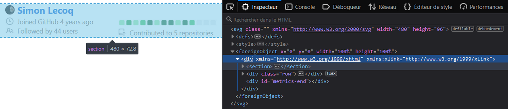

# 📊 Metrics

## 💪 Interested in contributing?

Nice! Read the few sections below to understand how this project is structured and how to implement new features.

## 🎬 Behind the scenes

This section explore some topics which explain globally how metrics was designed and how it works.

<details>
<summary>💬 Creating SVGs images on-the-fly</summary>

Metrics actually exploit the possibility of integrating HTML and CSS into SVGs, so basically creating these images is as simple as designing static web pages. It can even handle animations and transparency.



SVGs are templated through [EJS framework](https://github.com/mde/ejs) to make the whole rendering process easier thanks to variables, conditional and loop statements. Only drawback is that it tends to make syntax coloration a bit confused because templates are often misinterpreted as HTML tags markers (`<%= "EJS templating syntax" %>`).

Images (and custom fonts) are encoded into base64 to prevent cross-origin requests, while also removing any external dependencies, although it tends to increase files sizes.

Since SVG renders differently depending on OS and browsers (system fonts, CSS support, ...), it's pretty hard to compute dynamically height. Previously, it was computed with ugly formulas, but as it wasn't scaling really well (especially since the introduction of variable content length plugins). It was often resulting in large empty blank spaces or really badly cropped image.

To solve this, metrics now spawns a [puppeteer](https://github.com/puppeteer/puppeteer) instance and directly render SVG in a browser environment (with all animations disabled). An hidden "marker" element is placed at the end of the image, and is used to resize image through its Y-offset.


Additional bonus of using pupeeter is that it can take screenshots, making it easy to convert SVGs to PNG output.

Finally, SVGs image can be optimized through [svgo](https://github.com/svg/svgo), which helps to remove unused attributes and blank space, while also reducing a bit the file size.

</details>

<details>
<summary>💬 Gathering external data from GitHub APIs and Third-Party services</summary>

Metrics mostly use GitHub APIs since it is its primary target. Most of the time, data are retrieved through GraphQL to save APIs requests, but it sometimes fallback on REST for other features. Octokit SDKs are used to make it easier.

As for other external services (Twitter, Spotify, PageSpeed, ...), metrics use their respective APIs, usually making https requests through [axios](https://github.com/axios/axios) and by following their documentation. It would be overkill to install entire SDKs for these since plugins rarely uses more than 2/3 calls.

In last resort, pupeeter is seldom used to scrap websites, though its use tends to make things slow and unstable (as it'll break upon HTML structural changes).

</details>

<details>
<summary>💬 Web instance and GitHub action similarities</summary>

Historically, metrics used to be only a web service without any customization possible. The single input was a GitHub username, and was composed of what is now `base` content (along with `languages` and `followup` plugin, which is why they can be computed without any additional queries). That's why `base` content is handled a bit differently from plugins.

As it gathered more and more plugins over time, generating a single user's metrics was becoming costly both in terms of resources but also in APIs requests. It was thus decided to switch to GitHub Action. At first, it was just a way to explore possibilities of this GitHub feature, but now it's basically the full-experience of metrics (unless you use your own  self-hosted instance).

Both web instance and Action actually use the same entrypoint so they basically have the same features.
Action just format inputs into a query-like object (similarly to when url params are parsed by web instance), from which metrics compute the rendered image. It also makes testing easier, as test cases can be reused since only inputs differs.

</details>

<details>
<summary>💬 Testing and mocking</summary>

Testing is done through [jest](https://github.com/facebook/jest) framework.

While the best would be to work with real data during testing, to avoid consuming too much APIs requests for testing (and to be more planet friendly), they're [mocked](https://github.com/lowlighter/metrics/blob/master/source/app/mocks.mjs) using [JavaScript Proxies](https://developer.mozilla.org/en-US/docs/Web/JavaScript/Reference/Global_Objects/Proxy) and [Faker.js](https://github.com/marak/Faker.js/). Basically function calls are "trapped" and send randomly generated data from Faker.js if we're in a development environment.

</details>

## 👨‍💻 Extending metrics

This section explain how to create new templates and plugins, and contains references about used packages and project structure.
It also lists which contributions on main repository are accepted.

<details>
<summary>🤝 Accepted contributions</summary>

Thanks for wanting to help metrics growing!

Review below which contributions are accepted:
<table>
  <tr>
    <th>Section</th>
    <th>Examples</th>
    <th>Addition</th>
    <th>Deletion</th>
  </tr>
  <tr>
    <td>🧩 Plugins</td>
    <td></td>
    <td>✔️</td>
    <td>✔️</td>
  </tr>
  <tr>
    <td>🖼️ Templates</td>
    <td></td>
    <td>❌</td>
    <td>⭕</td>
  </tr>
  <tr>
    <td>🧪 Tests</td>
    <td><code>tests/metrics.test.js</code></td>
    <td>✔️</td>
    <td>✔️</td>
  </tr>
  <tr>
    <td>🧱 Core</td>
    <td><code>app/metrics.mjs</code>, <code>app/setup.mjs</code>, <code>Dockerfile</code>, <code>package.json</code> ...</td>
    <td>❌</td>
    <td>⭕</td>
  </tr>
  <tr>
    <td>🗃️ Repository</td>
    <td><code>.github</code>, <code>LICENSE</code>, <code>CONTRIBUTING.md</code>, ...</td>
    <td>❌</td>
    <td>❌</td>
  </tr>
</table>

**Legend**
* ✔️: Contributions welcomed!
* ⭕: Contributions welcomed, but must be discussed first with a maintainer
* ❌: Only maintainers can edit these files

Before working on something, ensure that it isn't listed in [In progress](https://github.com/lowlighter/metrics/projects/1#column-12158618) and that no open pull requests (including drafts) already implement what you want to do.

If it's listed in [Roadmap and todos](https://github.com/lowlighter/metrics/projects/1) be sure to let maintainers that you're working on it. As metrics remains a side projects, things being working can change from one day to another.

If you're unsure, always open an issue to obtain insights and feedback 🙂

And even if your changes don't get merged in [lowlighter/metrics](https://github.com/lowlighter/metrics), please don't be too sad.
Metrics is designed to be highly customizable, so you can always decide to generate metrics on your forked repository!

</details>


<details>
<summary>🗂️ Project structure</summary>

This section explain how metrics is structured.

**Metrics generator**

* `source/app/setup.mjs` contains configuration setup
* `source/app/mocks.mjs` contains mocked data used for tests
* `source/app/metrics.mjs` contains the metrics renderer
* `source/plugins/*` contains source code of plugins
* `source/queries/*` contains GraphQL queries
* `source/templates/*` contains templates files
* `source/templates/*/image.svg` contains the image template used to render metrics
* `source/templates/*/style.css` contains the style used to render metrics
* `source/templates/*/fonts.css` contains additional fonts used to render metrics
* `source/templates/*/template.mjs` contains the code used to prepare metrics data before rendering

**Web instance**

* `source/app/web/index.mjs` contains metrics web instance entry point
* `source/web/instance.mjs` contains metrics web instance source code
* `source/app/web/statics/*` contains metrics web instance static files
* `settings.example.json` contains metrics web instance settings example

**GitHub action**

* `action.yml` contains GitHub action descriptor
* `source/app/action/index.mjs` contains GitHub action source code

**Others**

* `tests/metrics.test.js` contains tests
* `Dockerfile` contains the docker instructions to build metrics image
* `package.json` contains dependencies lists of metrics along with command line aliases

</details>

<details>
<summary>📦 Packages</summary>

Below is a list of used packages.

* [express/express.js](https://github.com/expressjs/express) and [expressjs/compression](https://github.com/expressjs/compression)
  * To serve, compute and render a GitHub user's metrics
* [nfriedly/express-rate-limit](https://github.com/nfriedly/express-rate-limit)
  * To apply rate limiting on server and avoid spams and hitting GitHub API's own rate limit
* [octokit/graphql.js](https://github.com/octokit/graphql.js/) and [octokit/rest.js](https://github.com/octokit/rest.js)
  * To perform request to GitHub GraphQL API and GitHub REST API
* [mde/ejs](https://github.com/mde/ejs)
  * To render SVG images
* [ptarjan/node-cache](https://github.com/ptarjan/node-cache)
  * To cache generated content
* [renanbastos93/image-to-base64](https://github.com/renanbastos93/image-to-base64)
  * To generate base64 representation of users' avatars
* [svg/svgo](https://github.com/svg/svgo)
  * To optimize generated SVG
* [axios/axios](https://github.com/axios/axios)
  * To make HTTP/S requests
* [actions/toolkit](https://github.com/actions/toolkit/tree/master)
  * To build the GitHub Action
* [vuejs/vue](https://github.com/vuejs/vue) and [egoist/vue-prism-component](https://github.com/egoist/vue-prism-component) + [prismjs/prism](https://github.com/prismjs/prism)
  * To display server application
* [puppeteer/puppeteer](https://github.com/puppeteer/puppeteer)
  * To scrap the web
* [libxmljs/libxmljs](https://github.com/libxmljs/libxmljs)
  * To test and verify SVG validity
* [marak/colors.js](https://github.com/marak/colors.js)
  * To print colors in console
* [facebook/jest](https://github.com/facebook/jest) and [nodeca/js-yaml](https://github.com/nodeca/js-yaml)
  * For unit testing
* [marak/faker.js](https://github.com/marak/Faker.js/)
  * For mocking data

</details>


<details>
<summary>🖼️ Templates</summary>

Templates requires you to be comfortable with HTML, CSS and JavaScript ([EJS](https://github.com/mde/ejs) flavored).

Metrics does not really accept contributions on [default templates](https://github.com/lowlighter/metrics/tree/master/source/templates) to keep consistency and avoid bloating main repository with lots of templates, but fear not! It's really easy to create your own template.

If you make something awesome, don't hesistate to share it so user can use it!

Assuming you created a new template named `your-custom-template`, other users will be able to use this by using the following in their workflow:
```yaml
- uses: lowlighter/metrics@master
  with:
    # ... other options
    template: "@your-custom-template"
    setup_community_templates: your-github-login/metrics@master:your-custom-template
```

<details>
<summary>💬 Creating a new template from scratch</summary>

Find a cool name for your template and create an eponym folder in [`source/templates`](https://github.com/lowlighter/metrics/tree/master/source/templates).

Then, you'll need to create the following files:
- `image.svg` will contain the base render structure of your template
- `partials/` is a folder that'll contain parts of your template (called "partials")
  - `partials/_.json` is a JSON array which lists your partials (these will be displayed in the same order as listed, unless if overriden by user with `config_order` option)

The following files are optional:
- `fonts.css` can contain your custom fonts (base64 encoded) if needed
- `styles.css` can contain your CSS that'll style your template
- `template.mjs` can contain additional data processing and formatting at template-level

Optional files will fallback to the one defined in [`classic`](https://github.com/lowlighter/metrics/tree/master/source/templates/classic) template if unexistant.

Note that by default, `template.mjs` is skipped when using official release with community templates, to prevent malicious code to leaks token and credentials.

</details>

<details>
<summary>💬 Creating <code>image.svg</code></summary>

Once you finished setting up template folder structure, paste the following in `image.svg` to get started:
```html
<svg xmlns="http://www.w3.org/2000/svg" width="480" height="99999" class="<%= !animated ? 'no-animations' : '' %>">

  <defs><style><%= fonts %></style></defs>
  <style><%= style %></style>

  <foreignObject x="0" y="0" width="100%" height="100%">
    <div xmlns="http://www.w3.org/1999/xhtml" xmlns:xlink="http://www.w3.org/1999/xlink">
      <% for (const partial of [...partials]) { %>
        <%- await include(`partials/${partial}.ejs`) %>
      <% } %>

      <div id="metrics-end"></div>
    </div>
  </foreignObject>

</svg>
```

Let's explain what it does.

`fonts` and `style` variables will be populated with the same content as your `fonts.css` and `styles.css` files.
Like said previously, if these does not exists, it'll contain the same content as the `classic` template files.

The main loop will iterate on `partials` variable which contains your partials index set in `_.json`.

Finally, you may have noticed that `height` is set to a very high number, and that there is a `#metrics-end` element at the bottom of the SVG template. This is because rendered height is computed dynamically through a [puppeteer](https://github.com/puppeteer/puppeteer) browser instance which locate `#metrics-end` and use its *y-coordinate* and `config_padding` to set final height. So you should leave it like this to ensure your rendered image will be correctly sized.

</details>

<details>
<summary>💬 Customizing templates with partials</summary>

Partials are sections that'll be displayed in rendered metrics.

It's just HTML with CSS which can be templated through [EJS](https://github.com/mde/ejs) framework.
Basically, you can use JavaScript statements in templating tags (`<% %>`) to display variables content and to programmatically create content.

</details>

<details>
<summary>💬 Using custom fonts</summary>

This is actually not recommended because it drastically increases the size of generated metrics, but it should also make your rendering more consistant. The trick is to actually restrict the charset used to keep file size small.

Below is a simplified process on how to generate base64 encoded fonts to use in metrics:
1. Find a font on [fonts.google.com](https://fonts.google.com/)
  - Select regular, bold, italic and bold+italic fonts
  - Open `embed` tab and extract the `href`
2. Open extracted `href` and append `&text=` params with used characters from SVG
  - e.g. `&text=%26%27"%7C%60%5E%40°%3F!%23%24%25()*%2B%2C-.%2F0123456789%3A%3B<%3D>ABCDEFGHIJKLMNOPQRSTUVWXYZ%5B%5D_abcdefghijklmnopqrstuvwxyz%7B%7D~─└├▇□✕`
3. Download each font file from url links from the generated stylesheet
4. Convert them into base64 with `woff` extension on [transfonter.org]https://transfonter.org/) and download archive
5. Extract archive and copy the content of the generated stylesheet to `fonts.css`
6. Update your template
  - Include `<defs><style><%= fonts %></style></defs>` to your `image.svg`
  - Edit your `style.css` to use yout new font

</details>

</details>


<details>
<summary>🧩 Plugins</summary>

Plugins are self-sufficient and independant code functions that gather additional data from GitHub APIs or external sources.

<details>
<summary>💬 Plugin guidelines</summary>

- A plugin should never be dependent on others plugins
  - But they're allowed to use data gathered by main metrics function
- Avoid the need of new external dependencies (like SDKs)
  - Most of the time, SDKs are overkill when a few HTTP calls do the trick
  - `imports` probably contains a library that can help you achieving what you want
- Avoid using raw command when possible (like spawning sub-process)
  - Sub-process should be platform agnostic (i.e. working on most OS)
- Errors should always be handled gracefully by displaying an error message when it fails
  - When possible, try to display explicit error messages

</details>

<details>
<summary>💬 Creating a new plugin</summary>

Find a cool word to name your plugin and create an eponym folder in [`source/plugins`](https://github.com/lowlighter/metrics/tree/master/source/plugins) folder.

You'll also need to find an unused [emoji](https://emojipedia.org) that you'll be able to use as your plugin icon.

Then create an `index.mjs` in your plugin folder and paste the following code:
```js
//Setup
  export default async function ({login, q, imports, data, computed, rest, graphql, queries, account}, {enabled = false} = {}) {
    //Plugin execution
      try {
        //Check if plugin is enabled and requirements are met
          if ((!enabled)||(!q/* your plugin name */))
            return null
        //Results
          return {}
      }
    //Handle errors
      catch (error) {
        throw {error:{message:"An error occured", instance:error}}
      }
  }
```

The following inputs are available:
- `login` is set to GitHub login
- `q` contains all query parameters
- `imports` contains libraries and utilitaries that are shared amongst plugins
  - `imports.url` refers to [NodeJS `url` library](https://nodejs.org/api/url.html)
  - `imports.os` refers to [NodeJS `os` library](https://nodejs.org/api/os.html)
  - `imports.fs` refers to [NodeJS `fs` library](https://nodejs.org/api/fs.html)
  - `imports.paths` refers to [NodeJS `paths` library](https://nodejs.org/api/paths.html)
  - `imports.util` refers to [NodeJS `util` library](https://nodejs.org/api/util.html)
  - `imports.imgb64` refers to [renanbastos93/image-to-base64](https://github.com/renanbastos93/image-to-base64)
  - `imports.axios` refers to [axios/axios](https://github.com/axios/axios)
  - `imports.puppeteer` refers to [puppeteer/puppeteer](https://github.com/puppeteer/puppeteer)
  - `imports.run` is an helper to run raw command
  - `imports.shuffle` is an helper to shuffle array
  - `imports.__module` is an helper to find `__dirname` from a module url
  - And more...
- `data` and `computed` contains all data (and computed data) gathered by various APIs from main metrics function
- `graphql` and `rest` contains [octokit clients](https://github.com/octokit) for GitHub API
- `queries` contains autoloaded GraphQL queries with replacers
- `account` contains the type of account being worked on ("user" or "organization")

The second input contains configuration settings from [settings.json](https://github.com/lowlighter/metrics/blob/master/settings.example.json), which is mostly used by web instances.

Content of these parameters should **never** be edited directly, as your plugin should only return a new result.

Plugins are autoloaded so you do not need to do anything special to register them.

</details>

<details>
<summary>💬 Gathering new data from GitHub APIs and from Third-Party services</summary>

For GitHub related data, always try to use their [GraphQL API](https://docs.github.com/en/graphql) or their [REST API](https://docs.github.com/en/rest) when possible. Use `puppeteer` in last resort.

When using GraphQL API, `queries` object autoloads queries from [source/queries](https://github.com/lowlighter/metrics/tree/master/source/queries) and will replace all strings prefixed by a dollar sign (`$`) with eponym variables.

For example:
```js
//Calling this
  await graphql(queries.myquery({login:"github-user", account:"user"}))

//With this in source/queries/myquery.graphql
  query MyQuery {
    $account(login: "$login") {
      name
    }
  }

//Will have the same result as calling this
  await graphql(`
    query MyQuery {
      user(login: "github-user") {
        name
      }
    }
  `)
```

For REST API, check out their [documentation](https://octokit.github.io/rest.js/v18/).

As for Third-Party services, always prefer using their APIs (you can use [`imports.axios`](https://github.com/axios/axios) for easy HTTP requests) when they exists before having recourse to [`imports.puppeteer`](https://github.com/puppeteer/puppeteer).

New external dependencies should be avoided at all costs, especially since most of the time it's overkill to setup a new SDK.

</details>

<details>
<summary>💬 Creating a partial to display your plugin result</summary>

Create new files in `partials` of `source/templates` you want to support with `.ejs` extension.

You can paste the following for a quick start:
```html
<% if (plugins./* your plugin name */) { %>
  <section>
    <div class="row">
      <% if (plugins./* your plugin name */.error) { %>
        <section>
          <div class="field error">
            <svg xmlns="http://www.w3.org/2000/svg" viewBox="0 0 16 16" width="16" height="16"><path fill-rule="evenodd" d="M2.343 13.657A8 8 0 1113.657 2.343 8 8 0 012.343 13.657zM6.03 4.97a.75.75 0 00-1.06 1.06L6.94 8 4.97 9.97a.75.75 0 101.06 1.06L8 9.06l1.97 1.97a.75.75 0 101.06-1.06L9.06 8l1.97-1.97a.75.75 0 10-1.06-1.06L8 6.94 6.03 4.97z"></path></svg>
            <%= plugins./* your plugin name */.error.message %>
          </div>
        </section>
      <% } else { %>
          <section>
            <%# Do stuff in there -%>
          </section>
      <% } %>
    </div>
  </section>
<% } %>
```

Let's explain what it does.

First conditional statement will ensure that your partial only execute when your plugin is enabled.

The nested one will check if your plugin resulted in an error, and if that's the case, it'll display an error message instead.
Else, if it's successful, you'll get the second section in render.

Plugins errors should always be handled gracefully when possible.

If you need additional CSS rules, edits the `style.css` of edited template.

</details>

<details>
<summary>💬 Fast prototyping with web instance</summary>

The easiest way to test and prototype your plugin is to use a web instance.

Configure a [settings.json](https://github.com/lowlighter/metrics/blob/master/settings.example.json) with a valid GitHub token and with debug mode enabled.
Then start a web instance with `npm start` (you may have to run `npm install` if that's the first time you use the web instance).

Then try to generate your metrics in your browser with your GitHub user and your plugin enabled, and see if it works as expected:
```
http://localhost:3000/your-github-login?base=0&your-plugin-name=1
```

</details>

<details>
<summary>💬 Registering plugin options inputs</summary>

    🚧 This section is not available yet

</details>

<details>
<summary>💬 Create mocked data and tests</summary>

    🚧 This section is not available yet

</details>

<details>
<summary>💬 Updating README.md</summary>

    🚧 This section is not available yet

</details>

</details>

Written by [lowlighter](https://github.com/lowlighter)