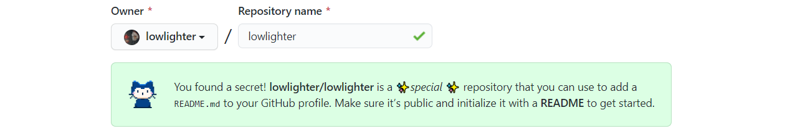
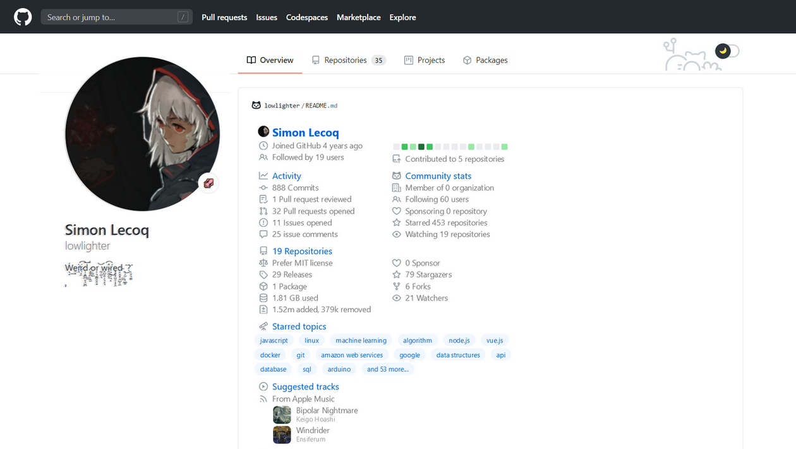
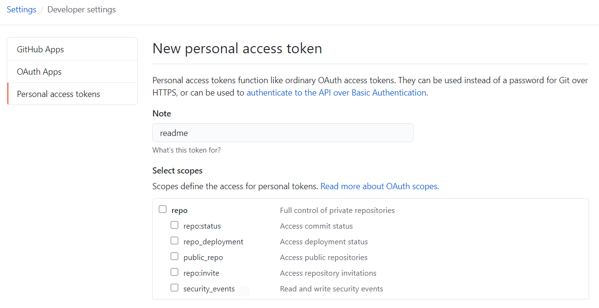
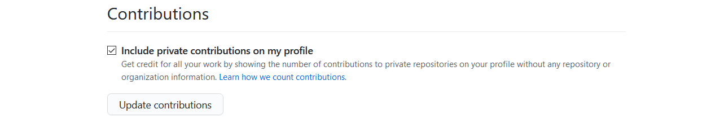
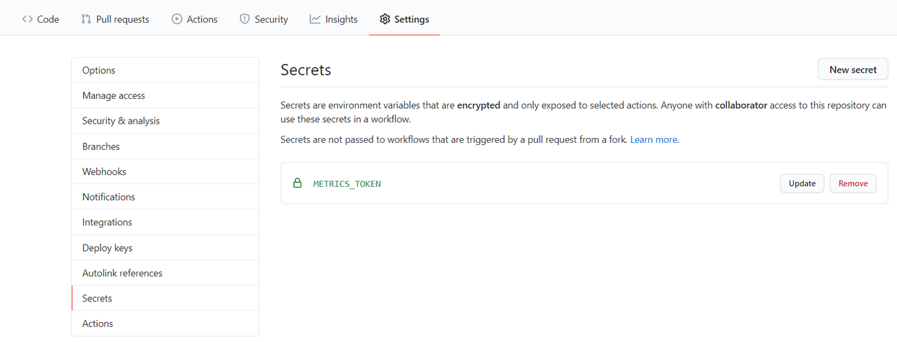
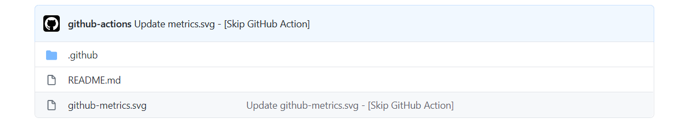
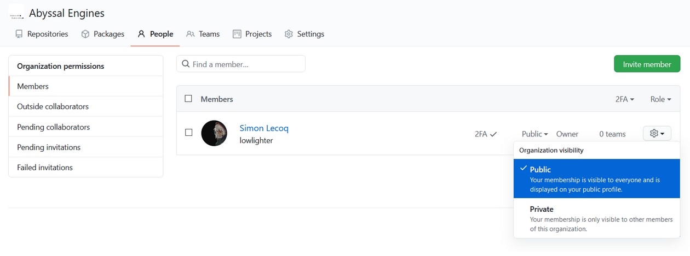

# 📊 Metrics


Generate your metrics that you can embed everywhere, including your GitHub profile readme! It works for both user and organization accounts, and even for repositories!

<table>
  <tr>
    <th align="center">For user accounts</th>
    <th align="center">For organization accounts</th>
  </tr>
  <tr>
    <td align="center">
      
      
    </td>
    <td align="center">
      
      
    </td>
  </tr>
</table>

<table>
  <tr>
    <th colspan="2" align="center">
      <a href="source/plugins/README.md">🧩 25 plugins</a>
    </th>
  </tr>
  <tr>
    <th><a href="source/plugins/activity/README.md">📰 Recent activity</a></th>
    <th><a href="source/plugins/contributors/README.md">🏅 Repository contributors</a></th>
  </tr>
  <tr>
    <td align="center">
      
      
    </td>
    <td align="center">
      
      <details open><summary>With number of contributions</summary>
        
      </details>
      
    </td>
  </tr>
  <tr>
    <th><a href="source/plugins/followup/README.md">🎟️ Follow-up of issues and pull requests</a></th>
    <th><a href="source/plugins/gists/README.md">🎫 Gists</a></th>
  </tr>
  <tr>
    <td align="center">
      
      
    </td>
    <td align="center">
      
      
    </td>
  </tr>
  <tr>
    <th><a href="source/plugins/habits/README.md">💡 Coding habits</a></th>
    <th><a href="source/plugins/introduction/README.md">🙋 Introduction</a></th>
  </tr>
  <tr>
    <td align="center">
      
      <details open><summary>Charts version</summary>
        
      </details>
      
    </td>
    <td align="center">
      <details open><summary>Account version</summary>
        
      </details>
      <details open><summary>Repository version</summary>
        
      </details>
      
    </td>
  </tr>
  <tr>
    <th><a href="source/plugins/isocalendar/README.md">📅 Isometric commit calendar</a></th>
    <th><a href="source/plugins/languages/README.md">🈷️ Most used languages</a></th>
  </tr>
  <tr>
    <td align="center">
      
      <details><summary>Full year version</summary>
        
      </details>
      
    </td>
    <td align="center">
      
      <details open><summary>With both total bytes size and percentage version</summary>
        
      </details>
      
    </td>
  </tr>
  <tr>
    <th><a href="source/plugins/licenses/README.md">📜 Repository licenses</a></th>
    <th><a href="source/plugins/lines/README.md">👨‍💻 Lines of code changed</a></th>
  </tr>
  <tr>
    <td align="center">
      
      <details><summary>With licenses ratio</summary>
        
      </details>
      
    </td>
    <td align="center">
      
      
    </td>
  </tr>
  <tr>
    <th><a href="source/plugins/people/README.md">🧑‍🤝‍🧑 People plugin</a></th>
    <th><a href="source/plugins/projects/README.md">🗂️ Active projects</a></th>
  </tr>
  <tr>
    <td align="center">
      
      <details><summary>Followed people version</summary>
        
      </details>
      <details><summary>Special thanks version</summary>
        
      </details>
      <details><summary>Repository template version</summary>
        
      </details>
      
    </td>
    <td align="center">
      
      
    </td>
  </tr>
  <tr>
    <th><a href="source/plugins/skyline/README.md">🌇 GitHub Skyline 3D calendar</a></th>
    <th><a href="source/plugins/stargazers/README.md">✨ Stargazers over last weeks</a></th>
  </tr>
  <tr>
    <td align="center">
      
      
    </td>
    <td align="center">
      
      
    </td>
  </tr>
  <tr>
    <th><a href="source/plugins/stars/README.md">🌟 Recently starred repositories</a></th>
    <th><a href="source/plugins/topics/README.md">📌 Starred topics</a></th>
  </tr>
  <tr>
    <td align="center">
      
      
    </td>
    <td align="center">
      
      <details open><summary>Mastered and known technologies version</summary>
        
      </details>
      
    </td>
  </tr>
  <tr>
    <th><a href="source/plugins/traffic/README.md">🧮 Repositories traffic</a></th>
    <th><a href="source/plugins/anilist/README.md">🌸 Anilist watch list and reading list</a></th>
  </tr>
  <tr>
    <td align="center">
      
    </td>
    <td align="center">
      
      <details><summary>Manga version</summary>
        
      </details>
      <details open><summary>Favorites characters version</summary>
        
      </details>
      
    </td>
  </tr>
  <tr>
    <th><a href="source/plugins/music/README.md">🎼 Music plugin</a></th>
    <th><a href="source/plugins/pagespeed/README.md">⏱️ Website performances</a></th>
  </tr>
  <tr>
    <td align="center">
      <details open><summary>🎼 Favorite tracks version</summary>
        
      </details>
      <details open><summary>Recently listened version</summary>
        
      </details>
      
    </td>
    <td align="center">
      
      <details><summary>Detailed version</summary>
        
      </details>
      <details><summary>With screenshot version</summary>
        
      </details>
      
    </td>
  </tr>
  <tr>
    <th><a href="source/plugins/posts/README.md">✒️ Recent posts</a></th>
    <th><a href="source/plugins/stackoverflow/README.md">🗨️ Stackoverflow plugin</a></th>
  </tr>
  <tr>
    <td align="center">
      
      
    </td>
    <td align="center">
      
      
    </td>
  </tr>
  <tr>
    <th><a href="source/plugins/tweets/README.md">🐤 Latest tweets</a></th>
    <th><a href="source/plugins/wakatime/README.md">⏰ WakaTime plugin</a></th>
  </tr>
  <tr>
    <td align="center">
      
      
    </td>
    <td align="center">
      
      
    </td>
  </tr>
  <tr>
    <th><a href="source/plugins/nightscout/README.md">💉 Nightscout</a></th>
    <th><a href="source/plugins//README.md"></a></th>
  </tr>
  <tr>
    <td align="center">
      
      
    </td>
    <td align="center"></td>
  </tr>
  <tr>
    <th colspan="2" align="center">
      <a href="https://github.com/lowlighter/metrics/projects/1">More to come soon!</a>
    </th>
  </tr>
</table>


<table>
  <tr>
    <th colspan="2" align="center">
      <a href="source/templates/README.md">🖼️ 3+ templates</a>
    </th>
  </tr>
  <tr>
    <th><a href="source/templates/classic/README.md">📗 Classic</a></th>
    <th><a href="source/templates/repository/README.md">📘 Repository</a></th>
  </tr>
  <tr>
    <td align="center">
      
      
    </td>
    <td align="center">
      
      
    </td>
  </tr>
  <tr>
    <th><a href="source/templates/terminal/README.md">📙 Terminal</a></th>
    <th><a href="source/templates/community/README.md">📕 Community templates</a></th>
  </tr>
  <tr>
    <td align="center">
      
      
    </td>
    <td align="center">See <a href="/source/templates/community/README.md">documentation</a> 🌍</td>
  </tr>
</table>


## 🦑 Interested to get your own?

Try it now at [metrics.lecoq.io](https://metrics.lecoq.io/) with your GitHub username!

Some plugins are not are not available at [metrics.lecoq.io](https://metrics.lecoq.io/), for a fully-featured experience use it as a [GitHub Action](https://github.com/marketplace/actions/github-metrics-as-svg-image) instead!

# 📜 How to use?

## ⚙️ Using GitHub Action on your profile repository (~5 min setup)

Setup a GitHub Action which runs periodically and pushes your generated metrics image to your repository.
See all supported options in [action.yml](action.yml).

Assuming your username is `my-github-user`, you can then embed rendered metrics in your readme like below:

```markdown
<!-- If you're using "master" as default branch -->

<!-- If you're using "main" as default branch -->

```

<details>
<summary>💬 How to setup?</summary>

### 0. Setup your personal repository

Create a repository with the same name as your GitHub login (if it's not already done).



Its `README.md` will be displayed on your user profile:



### 1. Create a GitHub personal token

From the `Developer settings` of your account settings, select `Personal access tokens` to create a new token.

No additional scopes are needed for basic metrics, but you may have to grant additional scope depending on what features you're planning to use:
- `public_repo` scope for some plugins
- `read:org` scope for all organizations related metrics
- `repo` scope for all private repositories related metrics



A scope-less token can still display private contributions by enabling `Include private contributions on my profile` in your account settings:



If a plugin has not enough scopes to operate (and `plugins_errors_fatal` isn't enabled), it'll be reported in the rendering like below:


### 2. Put your GitHub personal token in your repository secrets

Go to the `Settings` of your repository to create a new secret and paste your freshly generated GitHub token there.



### 3. Create a GitHub Action workflow in your repository

Create a new workflow from the `Actions` tab of your repository and paste the following:

```yaml
name: Metrics
on:
  # Schedule updates (each hour)
  schedule: [{cron: "0 * * * *"}]
  # Lines below let you run workflow manually and on each commit (optional)
  push: {branches: ["master", "main"]}
  workflow_dispatch:
jobs:
  github-metrics:
    runs-on: ubuntu-latest
    steps:
      # See action.yml for all options
      - uses: lowlighter/metrics@latest
        with:
          # Your GitHub token
          token: ${{ secrets.METRICS_TOKEN }}
          # GITHUB_TOKEN is a special auto-generated token restricted to current repository, which is used to push files in it
          committer_token: ${{ secrets.GITHUB_TOKEN }}
```

See all supported options in [action.yml](action.yml).

Rendered metrics will be committed to your repository on each run.



#### Choosing between `@latest`, `@master` or a fork

If you wish to use new features as they're being released, you can switch from `@latest` to `@master`.
As the latter is used as a development branch, jobs may fail from time to time (although we try to mitigate this).

When using a token with additional permissions, it is advised to fork this repository and use it instead to minimize security risks:
```yaml
      - uses: my-github-username/metrics@master
      # If you make changes on your fork, be sure not leave @latest as tag!
```

In this case, please consider watching new releases to stay up-to-date and enjoy latest features!

`@latest` will be updated on each release soon after [Planned for next release](https://github.com/lowlighter/metrics/projects/1#column-12378679) is emptied. Metrics doesn't introduce breaking changes **from an user point of view** (i.e. your workflows will always be valid) so you can follow release cycles without worrying.

#### Examples workflows

Metrics displayed on this page are rendered from this [workflow](https://github.com/lowlighter/lowlighter/blob/master/.github/workflows/metrics.yml) so you can check it out for some code examples about plugins usage.

You can also take a look at this [user workflow](https://github.com/lowlighter/lowlighter/blob/master/.github/workflows/personal.yml) if you want.

### 4. Embed link into your README.md

Update your README.md to embed your metrics:

```markdown
<!-- If you're using "master" as default branch -->

<!-- If you're using "main" as default branch -->

```

</details>

## 💕 Using the shared instance (~1 min setup, but with limitations)

For convenience, you can use the shared instance available at [metrics.lecoq.io](https://metrics.lecoq.io) without any additional setup.

```markdown

```

This is mostly intended for previews, to enjoy all features consider using GitHub Action instead.

<details>
<summary>💬 Fair use</summary>

To ensure service availability, shared instance has a few limitations:
  * Images are cached for 15 minutes
    * Rendered metrics **won't be updated** during this time window when queried
    * You can manually update rendering againg your metrics on [metrics.lecoq.io](https://metrics.lecoq.io)
  * A rate limiter is enabled to prevent denial of service (it doesn't affect already cached metrics)
  * Some plugins may not be available

Service is provided free of charge, so please be gentle with it 🙂

</details>

## 🏗️ Deploying your own web instance (~15 min setup, depending on your sysadmin knowledge)


Setup a metrics instance on your server if you don't want to use GitHub Actions and [metrics.lecoq.io](https://metrics.lecoq.io).
See all supported options in [settings.example.json](settings.example.json).

Assuming your username is `my-github-user`, you can then embed rendered metrics in your readme like below:

```markdown

```

<details>
<summary>💬 How to setup?</summary>

### 0. Prepare your server

You'll need a server with a recent version [NodeJS](https://nodejs.org) (see used version in [Dockerfile](Dockerfile#L1-L2)).

### 1. Create a GitHub personal token

From the `Developer settings` of your account settings, select `Personal access tokens` to create a new token.

No additional scopes are needed.


### 2. Install dependencies

Clone repository, install dependencies and copy configuration example to `settings.json`:

```shell
git clone https://github.com/lowlighter/metrics.git
cd metrics/
npm install --only=prod
cp settings.example.json settings.json
```

### 3. Configure your instance and start it

Edit `settings.json` to configure your instance.

```javascript
{
  //GitHub API token
    "token":"GITHUB_TOKEN",
  //Other options...
}
```

See all supported options in [settings.example.json](settings.example.json).

If you plan to make your web instance public, it is advised to restrict its access thanks to rate limiter and access list.

Once you've finished configuring metrics, start your instance:

```shell
npm start
```

Access your server with provided port in `setting.json` from your browser to ensure everything is working.

### 4. Embed link into your README.md

Edit your repository readme and add your metrics image from your server domain:

```markdown

```

### 6. (optional) Setup your instance as a service

To ensure that your instance will restart if it reboots or crashes, you should set it up as a service.
This is described below for Linux-like systems which support *systemd*.

Create a new service file `/etc/systemd/system/github_metrics.service` and paste the following after editing paths inside:

```ini
[Unit]
Description=Metrics
After=network-online.target
Wants=network-online.target

[Service]
Type=simple
WorkingDirectory=/path/to/metrics
ExecStart=/usr/bin/node /path/to/metrics/index.mjs

[Install]
WantedBy=multi-user.target
```

Reload services, enable it, start it and check if it is up and running:

```shell
systemctl daemon-reload
systemctl enable github_metrics
systemctl start github_metrics
systemctl status github_metrics
```

</details>

<details>
<summary>🔗 HTTP parameters</summary>

Most of options from [action.yml](action.yml) are actually supported by web instance, though syntax is slightly different.
All underscores (`_`) must be replaced by dots (`.`) and `plugin_` prefixes must be dropped.

For example, to configure pagespeed plugin you'd use the following:
```
https://my-personal-domain.com/my-github-user?pagespeed=1&pagespeed.detailed=1&pagespeed.url=https%3A%2F%2Fexample.com
```

Note that url parameters must be [encoded](https://developer.mozilla.org/fr/docs/Web/JavaScript/Reference/Objets_globaux/encodeURIComponent).

As for `base` content, which is enabled by default, sections are available through "`base.<section>`".

For example, to display only `repositories` section, use:
```
https://my-personal-domain.com/my-github-user?base=0&base.repositories=1
```

</details>


# 📚 Documentation


### 🧰 Template/plugin compatibily matrix

<table>
  <tr>
    <th nowrap="nowrap">Template\Plugin</th>    
    <th nowrap="nowrap" align="center" title="🗃️ Base content">🗃️</th>
    <th nowrap="nowrap" align="center" title="📰 Recent activity">📰</th>
    <th nowrap="nowrap" align="center" title="🏅 Repository contributors">🏅</th>
    <th nowrap="nowrap" align="center" title="🎟️ Follow-up of issues and pull requests">🎟️</th>
    <th nowrap="nowrap" align="center" title="🎫 Gists">🎫</th>
    <th nowrap="nowrap" align="center" title="💡 Coding habits">💡</th>
    <th nowrap="nowrap" align="center" title="🙋 Introduction">🙋</th>
    <th nowrap="nowrap" align="center" title="📅 Isometric commit calendar">📅</th>
    <th nowrap="nowrap" align="center" title="🈷️ Most used languages">🈷️</th>
    <th nowrap="nowrap" align="center" title="📜 Repository licenses">📜</th>
    <th nowrap="nowrap" align="center" title="👨‍💻 Lines of code changed">👨‍💻</th>
    <th nowrap="nowrap" align="center" title="🧑‍🤝‍🧑 People plugin">🧑‍🤝‍🧑</th>
    <th nowrap="nowrap" align="center" title="🗂️ Active projects">🗂️</th>
    <th nowrap="nowrap" align="center" title="🌇 GitHub Skyline 3D calendar">🌇</th>
    <th nowrap="nowrap" align="center" title="✨ Stargazers over last weeks">✨</th>
    <th nowrap="nowrap" align="center" title="🌟 Recently starred repositories">🌟</th>
    <th nowrap="nowrap" align="center" title="📌 Starred topics">📌</th>
    <th nowrap="nowrap" align="center" title="🧮 Repositories traffic">🧮</th>
    <th nowrap="nowrap" align="center" title="🌸 Anilist watch list and reading list">🌸</th>
    <th nowrap="nowrap" align="center" title="🎼 Music plugin">🎼</th>
    <th nowrap="nowrap" align="center" title="⏱️ Website performances">⏱️</th>
    <th nowrap="nowrap" align="center" title="✒️ Recent posts">✒️</th>
    <th nowrap="nowrap" align="center" title="🗨️ Stackoverflow plugin">🗨️</th>
    <th nowrap="nowrap" align="center" title="🐤 Latest tweets">🐤</th>
    <th nowrap="nowrap" align="center" title="⏰ WakaTime plugin">⏰</th>
    <th nowrap="nowrap" align="center" title="💉 Nightscout">💉</th>
  </tr>  
  <tr>
    <th nowrap="nowrap">📗 Classic</th>    
    <th nowrap="nowrap" align="center" data-plugin="base">✔️</th>
    <th nowrap="nowrap" align="center" data-plugin="activity">✔️</th>
    <th nowrap="nowrap" align="center" data-plugin="contributors">❌</th>
    <th nowrap="nowrap" align="center" data-plugin="followup">✔️</th>
    <th nowrap="nowrap" align="center" data-plugin="gists">✔️</th>
    <th nowrap="nowrap" align="center" data-plugin="habits">✔️</th>
    <th nowrap="nowrap" align="center" data-plugin="introduction">✔️</th>
    <th nowrap="nowrap" align="center" data-plugin="isocalendar">✔️</th>
    <th nowrap="nowrap" align="center" data-plugin="languages">✔️</th>
    <th nowrap="nowrap" align="center" data-plugin="licenses">❌</th>
    <th nowrap="nowrap" align="center" data-plugin="lines">✔️</th>
    <th nowrap="nowrap" align="center" data-plugin="people">✔️</th>
    <th nowrap="nowrap" align="center" data-plugin="projects">✔️</th>
    <th nowrap="nowrap" align="center" data-plugin="skyline">✔️</th>
    <th nowrap="nowrap" align="center" data-plugin="stargazers">✔️</th>
    <th nowrap="nowrap" align="center" data-plugin="stars">✔️</th>
    <th nowrap="nowrap" align="center" data-plugin="topics">✔️</th>
    <th nowrap="nowrap" align="center" data-plugin="traffic">✔️</th>
    <th nowrap="nowrap" align="center" data-plugin="anilist">✔️</th>
    <th nowrap="nowrap" align="center" data-plugin="music">✔️</th>
    <th nowrap="nowrap" align="center" data-plugin="pagespeed">✔️</th>
    <th nowrap="nowrap" align="center" data-plugin="posts">✔️</th>
    <th nowrap="nowrap" align="center" data-plugin="stackoverflow">✔️</th>
    <th nowrap="nowrap" align="center" data-plugin="tweets">✔️</th>
    <th nowrap="nowrap" align="center" data-plugin="wakatime">✔️</th>
    <th nowrap="nowrap" align="center" data-plugin="nightscout">✔️</th>
  </tr>
  <tr>
    <th nowrap="nowrap">📘 Repository</th>    
    <th nowrap="nowrap" align="center" data-plugin="base">✔️</th>
    <th nowrap="nowrap" align="center" data-plugin="activity">✔️</th>
    <th nowrap="nowrap" align="center" data-plugin="contributors">✔️</th>
    <th nowrap="nowrap" align="center" data-plugin="followup">✔️</th>
    <th nowrap="nowrap" align="center" data-plugin="gists">❌</th>
    <th nowrap="nowrap" align="center" data-plugin="habits">❌</th>
    <th nowrap="nowrap" align="center" data-plugin="introduction">✔️</th>
    <th nowrap="nowrap" align="center" data-plugin="isocalendar">❌</th>
    <th nowrap="nowrap" align="center" data-plugin="languages">✔️</th>
    <th nowrap="nowrap" align="center" data-plugin="licenses">✔️</th>
    <th nowrap="nowrap" align="center" data-plugin="lines">✔️</th>
    <th nowrap="nowrap" align="center" data-plugin="people">✔️</th>
    <th nowrap="nowrap" align="center" data-plugin="projects">✔️</th>
    <th nowrap="nowrap" align="center" data-plugin="skyline">❌</th>
    <th nowrap="nowrap" align="center" data-plugin="stargazers">✔️</th>
    <th nowrap="nowrap" align="center" data-plugin="stars">❌</th>
    <th nowrap="nowrap" align="center" data-plugin="topics">❌</th>
    <th nowrap="nowrap" align="center" data-plugin="traffic">✔️</th>
    <th nowrap="nowrap" align="center" data-plugin="anilist">❌</th>
    <th nowrap="nowrap" align="center" data-plugin="music">❌</th>
    <th nowrap="nowrap" align="center" data-plugin="pagespeed">✔️</th>
    <th nowrap="nowrap" align="center" data-plugin="posts">❌</th>
    <th nowrap="nowrap" align="center" data-plugin="stackoverflow">❌</th>
    <th nowrap="nowrap" align="center" data-plugin="tweets">❌</th>
    <th nowrap="nowrap" align="center" data-plugin="wakatime">❌</th>
    <th nowrap="nowrap" align="center" data-plugin="nightscout">❌</th>
  </tr>
  <tr>
    <th nowrap="nowrap">📙 Terminal</th>    
    <th nowrap="nowrap" align="center" data-plugin="base">✔️</th>
    <th nowrap="nowrap" align="center" data-plugin="activity">❌</th>
    <th nowrap="nowrap" align="center" data-plugin="contributors">❌</th>
    <th nowrap="nowrap" align="center" data-plugin="followup">❌</th>
    <th nowrap="nowrap" align="center" data-plugin="gists">✔️</th>
    <th nowrap="nowrap" align="center" data-plugin="habits">❌</th>
    <th nowrap="nowrap" align="center" data-plugin="introduction">❌</th>
    <th nowrap="nowrap" align="center" data-plugin="isocalendar">❌</th>
    <th nowrap="nowrap" align="center" data-plugin="languages">✔️</th>
    <th nowrap="nowrap" align="center" data-plugin="licenses">❌</th>
    <th nowrap="nowrap" align="center" data-plugin="lines">✔️</th>
    <th nowrap="nowrap" align="center" data-plugin="people">❌</th>
    <th nowrap="nowrap" align="center" data-plugin="projects">❌</th>
    <th nowrap="nowrap" align="center" data-plugin="skyline">❌</th>
    <th nowrap="nowrap" align="center" data-plugin="stargazers">❌</th>
    <th nowrap="nowrap" align="center" data-plugin="stars">❌</th>
    <th nowrap="nowrap" align="center" data-plugin="topics">❌</th>
    <th nowrap="nowrap" align="center" data-plugin="traffic">✔️</th>
    <th nowrap="nowrap" align="center" data-plugin="anilist">❌</th>
    <th nowrap="nowrap" align="center" data-plugin="music">❌</th>
    <th nowrap="nowrap" align="center" data-plugin="pagespeed">✔️</th>
    <th nowrap="nowrap" align="center" data-plugin="posts">❌</th>
    <th nowrap="nowrap" align="center" data-plugin="stackoverflow">❌</th>
    <th nowrap="nowrap" align="center" data-plugin="tweets">❌</th>
    <th nowrap="nowrap" align="center" data-plugin="wakatime">❌</th>
    <th nowrap="nowrap" align="center" data-plugin="nightscout">❌</th>
  </tr>
</table>

## 🖼️ Templates

Templates lets you change general appearance of rendered metrics.
See their respective documentation for more informations about how to setup them:

* [📗 Classic](/source/templates/classic/README.md)
* [📘 Repository](/source/templates/repository/README.md)
* [📙 Terminal](/source/templates/terminal/README.md)
* [📕 Community templates](/source/templates/community/README.md)

## 🧩 Plugins

Plugins are features which provide additional content and lets you customize your rendered metrics.
See their respective documentation for more informations about how to setup them:

* **Core**
  * [🗃️ Base content](/source/plugins/base/README.md)
  * [🧱 Core](/source/plugins/core/README.md)
* **Github**
  * [📰 Recent activity](/source/plugins/activity/README.md)
  * [🏅 Repository contributors](/source/plugins/contributors/README.md)
  * [🎟️ Follow-up of issues and pull requests](/source/plugins/followup/README.md)
  * [🎫 Gists](/source/plugins/gists/README.md)
  * [💡 Coding habits](/source/plugins/habits/README.md)
  * [🙋 Introduction](/source/plugins/introduction/README.md)
  * [📅 Isometric commit calendar](/source/plugins/isocalendar/README.md)
  * [🈷️ Most used languages](/source/plugins/languages/README.md)
  * [📜 Repository licenses](/source/plugins/licenses/README.md)
  * [👨‍💻 Lines of code changed](/source/plugins/lines/README.md)
  * [🧑‍🤝‍🧑 People plugin](/source/plugins/people/README.md)
  * [🗂️ Active projects](/source/plugins/projects/README.md)
  * [🌇 GitHub Skyline 3D calendar](/source/plugins/skyline/README.md)
  * [✨ Stargazers over last weeks](/source/plugins/stargazers/README.md)
  * [🌟 Recently starred repositories](/source/plugins/stars/README.md)
  * [📌 Starred topics](/source/plugins/topics/README.md)
  * [🧮 Repositories traffic](/source/plugins/traffic/README.md)
* **Social**
  * [🌸 Anilist watch list and reading list](/source/plugins/anilist/README.md)
  * [🎼 Music plugin](/source/plugins/music/README.md)
  * [⏱️ Website performances](/source/plugins/pagespeed/README.md)
  * [✒️ Recent posts](/source/plugins/posts/README.md)
  * [🗨️ Stackoverflow plugin](/source/plugins/stackoverflow/README.md)
  * [🐤 Latest tweets](/source/plugins/tweets/README.md)
  * [⏰ WakaTime plugin](/source/plugins/wakatime/README.md)
* **Health**
  * [💉 Nightscout](/source/plugins/nightscout/README.md)

### 🏦 Organizations metrics

While metrics targets mainly user accounts, it's possible to render metrics for organization accounts.


<details>
<summary>💬 Metrics for organizations</summary>

Setup is the same as for user accounts, though you'll need to add `read:org` scope, **whether you're member of target organization or not**.


You'll also need to set `user` option with your organization name.

If you're encounting errors and your organization is using single sign-on, try to [authorize your personal token](https://docs.github.com/en/free-pro-team@latest/github/authenticating-to-github/authorizing-a-personal-access-token-for-use-with-saml-single-sign-on).

Most of plugins supported by user accounts will work with organization accounts, but note that rendering metrics for organizations consume way more APIs requests.

To support private repositories, add full `repo` scope to your personal token.

#### ℹ️ Example workflow

```yaml
- uses: lowlighter/metrics@latest
  with:
    # ... other options
    token: ${{ secrets.METRICS_TOKEN }}          # A personal token from an user account with read:org scope
    committer_token: ${{ secrets.GITHUB_TOKEN }} # GitHub auto-generated token
    user: organization-name                      # Organization name
```

</details>

<details>
<summary>💬 Organizations memberships for user accounts</summary>

Only public memberships can be displayed by metrics by default.
You can manage your membership visibility in the `People` tab of your organization:



For organization memberships, add `read:org` scope to your personal token.


</details>

## 💪 Customizing and contributing

Metrics is built to be easily customizable.
Fork this repository, switch used action from `lowlighter/metrics@latest` to your fork and start coding!

To report a bug fill an [issue](https://github.com/lowlighter/metrics/issues) describing it.

To suggest new features or requesting help to setup metrics, check out [discussions](https://github.com/lowlighter/metrics/discussions).

If you want to contribute, submit a [pull request](https://github.com/lowlighter/metrics/pulls).
Be sure to read [CONTRIBUTING.md](CONTRIBUTING.md) for more information about this.


## 📜 License

```
MIT License
Copyright (c) 2020 lowlighter
```


## 📖 Useful references

* [GitHub GraphQL API](https://docs.github.com/en/graphql)
* [GitHub GraphQL Explorer](https://docs.github.com/en/free-pro-team@latest/graphql/overview/explorer)
* [GitHub Rest API](https://docs.github.com/en/rest)
* [GitHub Octicons](https://github.com/primer/octicons)
  * See [GitHub Logos and Usage](https://github.com/logos) for more information.

### ✨ Inspirations

* [anuraghazra/github-readme-stats](https://github.com/anuraghazra/github-readme-stats)
* [jstrieb/github-stats](https://github.com/jstrieb/github-stats)
* [ankurparihar/readme-pagespeed-insights](https://github.com/ankurparihar/readme-pagespeed-insights)
* [jasonlong/isometric-contributions](https://github.com/jasonlong/isometric-contributions)
* [jamesgeorge007/github-activity-readme](https://github.com/jamesgeorge007/github-activity-readme)


