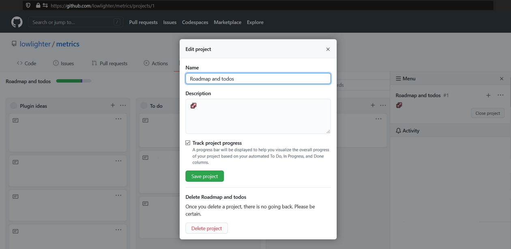

# 📊 Metrics


Generate your metrics that you can embed everywhere, including your GitHub profile readme! It works for both user and organization accounts!

<table>
  <tr>
    <th>For user accounts</th>
    <th>For organization accounts</th>
  </tr>
  <tr>
    <td>
      
    </td>
    <td>
      
    </td>
  </tr>
</table>

But there's more with [plugins](https://github.com/lowlighter/metrics/tree/master/source/plugins) and [templates](https://github.com/lowlighter/metrics/tree/master/source/templates)!

<table>
  <tr>
    <th><a href="#%EF%B8%8F-pagespeed">⏱️ Google PageSpeed plugin</a></th>
    <th><a href="#-isometric-calendar">📅 Isometric calendar plugin</a></th>
  </tr>
  <tr>
    <td>
      <a href="#%EF%B8%8F-pagespeed">
        
      </a>
      <details><summary>Detailed audit version</summary>
        <a href="#%EF%B8%8F-pagespeed">
          
        </a>
      </details>
      <details><summary>With screenshot version</summary>
        <a href="#%EF%B8%8F-pagespeed">
          
        </a>
      </details>
    </td>
    <td>
      <a href="#-isometric-calendar">
        
      </a>
      <details><summary>Full year version</summary>
        <a href="#-isometric-calendar">
          
        </a>
      </details>
    </td>
  </tr>
  <tr>
    <th><a href="#-music">🎼 Favorite music tracks plugin</a></th>
    <th><a href="#-music">🎧 Recently listened music plugin</a></th>
  </tr>
  <tr>
    <td>
      <a href="#-music">
        
      </a>
    </td>
    <td>
      <a href="#-music">
        
      </a>
    </td>
  </tr>
  <tr>
    <th><a href="#%EF%B8%8F-languages">🈷️ Most used languages plugin</a></th>
    <th><a href="#%EF%B8%8F-follow-up">🎟️ Follow-up plugin</a></th>
  </tr>
  <tr>
    <td>
      <a href="#%EF%B8%8F-languages">
        
      </a>
    </td>
    <td>
      <a href="#%EF%B8%8F-follow-up">
        
      </a>
    </td>
  </tr>
  <tr>
    <th><a href="#-topics">📌 Starred topics plugin</a></th>
    <th><a href="#%EF%B8%8F-projects">🗂️ Active projects plugin</a></th>
  </tr>
  <tr>
    <td>
      <a href="#-topics">
        
      </a>
      <details open><summary>Mastered and known technologies version</summary>
        <a href="#-topics">
          
        </a>
      </details>
    </td>
    <td>
      <a href="#%EF%B8%8F-projects">
        
      </a>
    </td>
  </tr>
  <tr>
    <th><a href="#-lines">👨‍💻 Lines of code plugin</a></th>
    <th><a href="#-traffic">🧮 Repositories traffic plugin</a></th>
  </tr>
  <tr>
    <td>
      <a href="#-lines">
        
      </a>
    </td>
    <td>
      <a href="#-traffic">
        
      </a>
    </td>
  </tr>
  <tr>
    <th><a href="#-tweets">🐤 Tweets plugin</a></th>
    <th><a href="#%EF%B8%8F-posts">✒️ Recent posts plugin</a></th>
  </tr>
  <tr>
    <td>
      <a href="#-tweets">
        
      </a>
    </td>
    <td>
      <a href="#%EF%B8%8F-posts">
        
      </a>
    </td>
  </tr>
  <tr>
    <th><a href="#-habits">💡 Coding Habits plugin</a></th>
    <th><a href="#-activity">📰 Activity plugin</a></th>
  </tr>
  <tr>
    <td>
      <a href="#-habits">
        
      </a>
      <details open><summary>With charts version</summary>
        <a href="#-habits">
          
        </a>
      </details>
    </td>
    <td>
      <a href="#-activity">
        
      </a>
    </td>
  </tr>
  <tr>
    <th><a href="#-stargazers">✨ Stargazers evolution</a></th>
    <th><a href="#-stars">🌟 Recently starred repositories</a></th>
  </tr>
  <tr>
    <td>
      <a href="#-stargazers">
        
      </a>
    </td>
    <td>
      <a href="#-stars">
        
      </a>
    </td>
  </tr>
  <tr>
    <th><a href="#-gists">🎫 Gists plugin</a></th>
    <th><a href="#-people">🧑‍🤝‍🧑 People plugin</a></th>
  </tr>
  <tr>
    <td>
      <a href="#-gists">
        
      </a>
    </td>
    <td>
      <a href="#-people">
        
      </a>
      <details><summary>Followed people version</summary>
        <a href="#-people">
          
        </a>
      </details>
      <details><summary>Special thanks version</summary>
        <a href="#-people">
          
        </a>
      </details>
      <details><summary>Repository template version</summary>
        <a href="#-people">
          
        </a>
      </details>
    </td>
  </tr>
  <tr>
    <th><a href="#-anilist">🌸 Anilist plugin</a></th>
    <th><a href="#%EF%B8%8F-base-content">🗃️ Header special features</a></th>
  </tr>
  <tr>
    <td>
      <a href="#-anilist">
        
      </a>
      <details><summary>Manga version</summary>
        <a href="#-anilist">
          
        </a>
      </details>
      <details open><summary>Favorites characters version</summary>
        <a href="#-anilist">
          
        </a>
      </details>
    </td>
    <td>
      <a href="#%EF%B8%8F-base-content">
        
      </a>
    </td>
  </tr>
  <tr>
    <td colspan="2" align="center">
      <a href="https://github.com/lowlighter/metrics/projects/1">
        More to come soon!
      </a>
    </td>
  </tr>
</table>

<table>
  <tr>
    <th>Classic template</th>
    <th>Terminal template</th>
  </tr>
  <tr>
    <td>
      
    </td>
    <td>
      
    </td>
  </tr>
  <tr>
    <th>Repository template<br><sup>A special template to embed on any repository readme!</sup></th>
    <th></th>
  </tr>
  <tr>
    <td>
      
    </td>
    <td>
    </td>
  </tr>
  <tr>
    <td colspan="2" align="center">
      <a href="https://github.com/lowlighter/metrics/projects/1">
        More to come soon!
      </a>
    </td>
  </tr>
</table>

## 🦑 Interested to get your own?

Try it now at [metrics.lecoq.io](https://metrics.lecoq.io/) with your GitHub username!

Because certain plugins require additional configuration and setup, some of them are not available at [metrics.lecoq.io](https://metrics.lecoq.io/).
For a fully-featured experience, consider using this as a [GitHub Action](https://github.com/marketplace/actions/github-metrics-as-svg-image) instead!

# 📜 How to use?

## ⚙️ Using GitHub Action on your profile repository (~5 min setup)

Set up a GitHub Action which runs periodically and pushes your generated metrics image on your repository.
See all supported options in [action.yml](action.yml).

Assuming your username is `my-github-user`, you can then embed your metrics in your repository readme like below:

```markdown

```

(or, for a new repository with a default branch of `main`):

```markdown

```

<details>
<summary>💬 How to setup?</summary>

### 0. Prepare your personal repository

Create a repository with the same name as your GitHub username if it's not already done.


Its `README.md` will be displayed on your user profile:


### 1. Create a GitHub token

From the `Developer settings` of your account settings, select `Personal access tokens` to create a new token.

No additional scopes are needed, unless you want to include your private repositories metrics.


With a scope-less token, you can still display private contributions by enabling `Include private contributions on my profile` in your account settings:


Some plugins also require additional scopes, which is indicated in their respective documentation.
In case your token does not have the required scope (and `plugins_errors_fatal` is not enabled), it will be directly notified in the plugin render like below:


### 2. Set your GitHub token in your personal repository secrets

Go to the `Settings` of your personal repository to create a new secret and paste your freshly generated GitHub token there.


### 3. Create a new GitHub Action workflow on your personal repository

Create a new workflow from the `Actions` tab of your personal repository and paste the following:

```yaml
name: Metrics
on:
  # Schedule updates
  schedule: [{cron: "0 * * * *"}]
  # Lines below let you run workflow manually and on each commit
  push: {branches: ["master", "main"]}
  workflow_dispatch:
jobs:
  github-metrics:
    runs-on: ubuntu-latest
    steps:
      # See action.yml for all options
      - uses: lowlighter/metrics@latest
        with:
          # Your GitHub token
          token: ${{ secrets.METRICS_TOKEN }}
          # GITHUB_TOKEN is a special auto-generated token restricted to current repository, which is used to push files in it
          committer_token: ${{ secrets.GITHUB_TOKEN }}
```

See all supported options in [action.yml](action.yml).

When using a token with additional permissions, it is advised to fork this repository to minimize security risks:
```yaml
      - uses: my-github-username/metrics@latest
```
In this case, consider watching new releases of this repository to stay up-to-date and enjoy latest features!

#### Preview vs release

It is possible to use `@master` instead of `@latest` to use new features before their official release.
Breaking changes may occur occasionally on `@master`, which could result in your metrics not being generated temporarily.

#### What will happen?

A new metrics image will be generated and committed to your repository on each run.


#### Workflow examples

Check out this [workflow](https://github.com/lowlighter/lowlighter/blob/master/.github/workflows/metrics.yml) file which generates metrics daily.

Note that most of steps presented there are illustrative examples for this readme and are actually not needed to generate your own metrics.

### 4. Embed the link into your README.md

Edit your repository readme and add your metrics image:

```markdown

```

</details>

## 💕 Using the shared instance (~1 min setup, but with limitations)

For convenience, you can use the shared instance available at [metrics.lecoq.io](https://metrics.lecoq.io) without any additional setup.

Assuming your username is `my-github-user`, you can embed your metrics in your repository readme like below:

```markdown

```

Visit [metrics.lecoq.io](https://metrics.lecoq.io) for more informations.

<details>
<summary>💬 Restrictions and fair use</summary>

Since GitHub API has rate limitations, the shared instance has a few limitations:
  * Images are cached for 1 hour
    * Your generated metrics won't be updated during this amount of time when queried
  * A rate limiter is enabled, although it won't affect already cached users metrics
  * Plugins which consume additional requests, or require additional token scopes are disabled

If you're appreciating this project, consider using it as a GitHub Action instead.

</details>

## 🏗️ Deploying your own web instance (~15 min setup, depending on your sysadmin knowledge)

It is possible to set up your own instance if you don't want to use GitHub Actions or if you want to allow others users on your instance.

When sharing an instance, it is advised to restrict the number of users which can use it through the rate limiter or the access list, to avoid reaching the requests limit of GitHub APIs.

See all supported options in [settings.example.json](settings.example.json).

<details>
<summary>💬 How to setup?</summary>

### 0. Prepare your server

You will need a server where you can set up and run a NodeJS application.

### 1. Create a GitHub token

From the `Developer settings` of your account settings, select `Personal access tokens` to create a new token.

No additional scopes are needed.


### 2. Install dependencies

Connect to server and ensure [NodeJS](https://nodejs.org/en/) is installed (see tested version in [workflow](.github/workflows/workflow.yml#L18)).

Run the following commands to clone this repository, install dependencies and copy configuration example file:

```shell
git clone https://github.com/lowlighter/metrics.git
cd metrics/
npm install --only=prod
cp settings.example.json settings.json
```

### 3. Configure your instance

Edit `settings.json` to configure your instance.

```javascript
{
  //See settings.example.json for all options
  //GitHub API token
    "token":"****************************************"
}
```

See all supported options in [settings.example.json](settings.example.json).

### 4. Start your instance

Run the following command to start your instance once you've finished configuring it:

```shell
npm start
```

From your browser, you should be able to access your web instance on the port you provided in `setting.json`.

### 5. Embed the link into your README.md

Edit your repository readme and add your metrics image from your server domain:

```markdown

```

### 6. (optional) Setup as service on your instance

To ensure that your instance will restart if it reboots or crashes, you should set it up as a service.
This is described below for Linux-like systems which support *systemd*.

Create a new service file `/etc/systemd/system/github_metrics.service` and paste the following after editing paths inside:

```
[Unit]
Description=Metrics
After=network-online.target
Wants=network-online.target

[Service]
Type=simple
WorkingDirectory=/path/to/metrics
ExecStart=/usr/bin/node /path/to/metrics/index.mjs

[Install]
WantedBy=multi-user.target
```

Reload services, enable it, start it and check if it is up and running:

```shell
systemctl daemon-reload
systemctl enable github_metrics
systemctl start github_metrics
systemctl status github_metrics
```

</details>

<details>
<summary>⚠️ HTTP errors code</summary>

The following error codes may be encountered on a web instance:

| Error code                | Description                                                                |
| ------------------------- | -------------------------------------------------------------------------- |
| `400 Bad request`         | Invalid query (e.g. unsupported template)                                  |
| `403 Forbidden`           | User not allowed in `restricted` users list                                |
| `404 Not found`           | GitHub API did not found the requested user                                |
| `429 Too many requests`   | Thrown when rate limiter is trigerred                                      |
| `500 Internal error`      | Server error while generating metrics images (check logs for more details) |
| `503 Service unavailable` | Maximum user capacity reached, only cached images can be accessed for now  |

</details>

<details>
<summary>🔗 HTTP parameters</summary>

Generated metrics images from a web instance can be configured through URL parameters.

#### Configuring base content

Base content is enabled by default, but passing `?base=0` will disable all base content.
You can choose to selectively enable or disable a specific `<section>` with `?base.<section>=<1|0>`.

For example, to opt out from `activity`, `community` and `metadata`, append `?base.activity=0&base.community=0&base.metadata=0` to your metrics url.

#### Configuring plugins

Plugins are disabled by default, but passing `?<plugin>=1` will enable a specific `<plugin>`.
Plugin options can be passed with `?<plugin>.<option>=<value>`.

For example, to enable `music` plugin and configure `music` plugin, you could append the following to your metrics url: `?music=1&music.provider=spotify&music.mode=recent&music.limit=4`.

Basically, most of [action.yml](action.yml) options can actually be used by web instance, with `plugin_` prefix dropped, and `.` instead of `_`.

</details>

# 📚 Documentation

## 🖼️ Templates

Templates allow you to change the general appearance of your metrics images.
Some metrics may be displayed differently, and all plugins may not be supported or behave the same from one template to another.

Consider trying them at [metrics.lecoq.io](https://metrics.lecoq.io)!

The default template is `classic`.

### 🧰 Template/plugin compatibily matrix

<table>
  <tr>
    <th nowrap="nowrap">Template\Plugin</th>
    <th nowrap="nowrap"><span title="Base content">🗃️<sup>Ø<sup>P</sup></sup></span></th>
    <th nowrap="nowrap"><span title="PageSpeed">⏱️</span></th>
    <th nowrap="nowrap"><span title="Isometric calendar">📅<sup>Ø</sup></span></th>
    <th nowrap="nowrap"><span title="Music">🎼</span></th>
    <th nowrap="nowrap"><span title="Languages">🈷️</span></th>
    <th nowrap="nowrap"><span title="Follow-up">🎟️</span></th>
    <th nowrap="nowrap"><span title="Topics">📌<sup>Ø</sup></span></th>
    <th nowrap="nowrap"><span title="Projects">🗂️</span></th>
    <th nowrap="nowrap"><span title="Lines">👨‍💻</span></th>
    <th nowrap="nowrap"><span title="Traffic">🧮</span></th>
    <th nowrap="nowrap"><span title="Tweets">🐤</span></th>
    <th nowrap="nowrap"><span title="Posts">✒️</span></th>
    <th nowrap="nowrap"><span title="Habits">💡</span></th>
    <th nowrap="nowrap"><span title="Activity">📰</span></th>
    <th nowrap="nowrap"><span title="Stars">🌟<sup>Ø</sup></span></th>
    <th nowrap="nowrap"><span title="Stargazers">✨</span></th>
    <th nowrap="nowrap"><span title="Gists">🎫<sup>Ø</sup></span></th>
    <th nowrap="nowrap"><span title="People">🧑‍🤝‍🧑</span></th>
    <th nowrap="nowrap"><span title="Anilist">🌸</span></th>
  </tr>
  <tr>
    <th nowrap="nowrap">Classic</th>
    <td nowrap="nowrap" data-for="base">✔️</td>
    <td nowrap="nowrap" data-for="pagespeed">✔️</td>
    <td nowrap="nowrap" data-for="isocalendar">✔️</td>
    <td nowrap="nowrap" data-for="music"><span title="Last.fm provider on @master">✔️<sup>N</sup></span></td>
    <td nowrap="nowrap" data-for="languages"><span title="Use customs colors on @master">✔️<sup>N</sup></span></td>
    <td nowrap="nowrap" data-for="followup">✔️</td>
    <td nowrap="nowrap" data-for="topics">✔️</td>
    <td nowrap="nowrap" data-for="projects">✔️</td>
    <td nowrap="nowrap" data-for="lines">✔️</td>
    <td nowrap="nowrap" data-for="traffic">✔️</td>
    <td nowrap="nowrap" data-for="tweets">✔️</td>
    <td nowrap="nowrap" data-for="posts">✔️</td>
    <td nowrap="nowrap" data-for="habits">✔️</td>
    <td nowrap="nowrap" data-for="activity">✔️</td>
    <td nowrap="nowrap" data-for="stars">✔️</td>
    <td nowrap="nowrap" data-for="stargazers">✔️</td>
    <td nowrap="nowrap" data-for="gists"><span title="100+ gists support on @master">✔️<sup>N</sup></span></td>
    <td nowrap="nowrap" data-for="people"><span title="'thanks', 'sponsors' and 'sponsoring' available on @master">✔️<sup>N</sup></span></td>
    <td nowrap="nowrap" data-for="anilist"><span title="Available on @master">✔️<sup>M</sup></span></td>
  </tr>
  <tr>
    <th nowrap="nowrap">Terminal</th>
    <td nowrap="nowrap" data-for="base"><span title="'Available for hire' and 'Cake day' are not displayed">✔️<sup>P</sup></span></td>
    <td nowrap="nowrap" data-for="pagespeed">✔️</td>
    <td nowrap="nowrap" data-for="isocalendar">❌</td>
    <td nowrap="nowrap" data-for="music">❌</td>
    <td nowrap="nowrap" data-for="languages">✔️</td>
    <td nowrap="nowrap" data-for="followup">✔️</td>
    <td nowrap="nowrap" data-for="topics">❌</td>
    <td nowrap="nowrap" data-for="projects">❌</td>
    <td nowrap="nowrap" data-for="lines">✔️</td>
    <td nowrap="nowrap" data-for="traffic">✔️</td>
    <td nowrap="nowrap" data-for="tweets">❌</td>
    <td nowrap="nowrap" data-for="posts">❌</td>
    <td nowrap="nowrap" data-for="habits">❌</td>
    <td nowrap="nowrap" data-for="activity">❌</td>
    <td nowrap="nowrap" data-for="stars">❌</td>
    <td nowrap="nowrap" data-for="stargazers">❌</td>
    <td nowrap="nowrap" data-for="gists"><span title="100+ gists support on @master">✔️<sup>N</sup></span></td>
    <td nowrap="nowrap" data-for="people">❌</td>
    <td nowrap="nowrap" data-for="anilist">❌</td>
  </tr>
  <tr>
    <th nowrap="nowrap">Repository<sup>R</sup></th>
    <td nowrap="nowrap" data-for="base">✔️</td>
    <td nowrap="nowrap" data-for="pagespeed">✔️</td>
    <td nowrap="nowrap" data-for="isocalendar">❌</td>
    <td nowrap="nowrap" data-for="music">❌</td>
    <td nowrap="nowrap" data-for="languages">✔️</td>
    <td nowrap="nowrap" data-for="followup">✔️</td>
    <td nowrap="nowrap" data-for="topics">❌</td>
    <td nowrap="nowrap" data-for="projects">✔️</td>
    <td nowrap="nowrap" data-for="lines">✔️</td>
    <td nowrap="nowrap" data-for="traffic">✔️</td>
    <td nowrap="nowrap" data-for="tweets">❌</td>
    <td nowrap="nowrap" data-for="posts">❌</td>
    <td nowrap="nowrap" data-for="habits">❌</td>
    <td nowrap="nowrap" data-for="activity">❌</td>
    <td nowrap="nowrap" data-for="stars">❌</td>
    <td nowrap="nowrap" data-for="stargazers">✔️</td>
    <td nowrap="nowrap" data-for="gists">❌</td>
    <td nowrap="nowrap" data-for="people"><span title="Available on @master">✔️<sup>M</sup></span></td>
    <td nowrap="nowrap" data-for="anilist">❌</td>
  </tr>
</table>

**Legend**
* **P**: Partial support *(Hover cell for more informations)*
* **M**: Feature is not released yet but is available on `@master`
* **N**: Feature is already released, but new ones are available on `@master`
* **R**: Repository template (all plugins content will be scoped to related repository)
* **Ø**: Feature is not supported for organization accounts
* **Ø<sup>P</sup>**: Feature is supported partially for organization accounts

<details>
<summary>💬 Using community templates</summary>

    🚧 This feature is available as pre-release on @master branch (unstable)

It is possible to use official releases along with custom templates from forked repositories (not necessarily your own).
This can be used to use different layouts, styles colors, etc.

Use `setup_community_templates` option to specify additional external sources in the following format: `user/repo@branch:template`. Templates added this way will be downloaded through git and will be available with the same template name but prefixed with `@`.

For example, to use the `super-metrics` template from `github-user`'s fork, add the following:
```yaml
- uses: lowlighter/metrics@master
  with:
    # ... other options
    template: "@super-metrics"
    setup_community_templates: github-user/metrics@master:classic
```

By default, community templates have their `template.mjs` removed and fallback to the one used by `classic` template.
It means that they're restricted to common and plugins data, to prevent malicious code injection and token leaks.

If you really trust a template, it is possible to bypass this behaviour by appending `+trust` at the end of their source like below:
```yaml
- uses: lowlighter/metrics@master
  with:
    # ... other options
    setup_community_templates: github-user/metrics@master:classic+trust
```

To create a new community template, just fork this repository and create a folder in `/source/templates` with the same structure as current templates.
Then, it's just as simple as HTML and CSS with a bit of JavaScript!

</details>

<details>
<summary>💬 Using repository template</summary>

To use `repository` template, you'll need to provide a repository name in `query` option.

If the repository owner is different from the `token` owner, use the `user` option to specify it.

Add the following to your workflow:
```yaml
- uses: lowlighter/metrics@latest
  with:
    # ... other options
    template: repository
    user: "repository-owner"
    query: '{"repo":"repository-name"}'
```

</details>

<details>
<summary>💬 Generating metrics for organizations</summary>

    🚧 This feature is available as pre-release on @master branch (unstable)

It is also possible to generate metrics for organization accounts.


Setup is the same as for user accounts (i.e. a personal token from an user account and use of `GITHUB_TOKEN` for commits) but you'll need to change `user` option to your organization name.

Additionally, you'll need to add the `read:org` scope to your personal token, *whether you're member of target organization or not*.


Resulting workflow should look like below:
```yaml
- uses: lowlighter/metrics@master
  with:
    # ... other options
    token: ${{ secrets.METRICS_TOKEN }} # A personal token from an user account with read:org scope
    committer_token: ${{ secrets.GITHUB_TOKEN }}
    user: "organization-name"
```

You may also need to [authorize your personal token](https://docs.github.com/en/free-pro-team@latest/github/authenticating-to-github/authorizing-a-personal-access-token-for-use-with-saml-single-sign-on) if you're using single sign-on and are encounting errors.

Note that `repositories` option will be capped to 25 repositories to ensure that GraphQL queries does not timeout, so you may end up using more requests than for user accounts.

Although some plugins may be noted as compatible with an organization account, it may not be actually possible to run them successfully depending of your organization size. As some of plugins use a lot of requests, you'll eventually reach the rate-limiter before all of your metrics are generated for large organizations.

</details>

## 🧩 Plugins

Plugins are features which can provide additional metrics and features.
In return, they may require additional configuration and consume additional API requests.

### 🗃️ Base content

Generated metrics contains a few sections that are enabled by default, such as recent activity, community stats and repositories stats.
This can be configured by explicitly opting out from them.

<details>
<summary>💬 About</summary>

By default, generated metrics contain the following sections:
* `header`, which usually contains your username, your two-week commits calendars and a few additional data
* `activity`, which contains your recent activity (commits, pull requests, issues, etc.)
* `community`, which contains your community stats (following, sponsors, organizations, etc.)
* `repositories`, which contains your repositories stats (license, forks, stars, etc.)
* `metadata`, which contains informations about generated metrics

You can explicitely opt out from them, which can be useful if you only want to keep a few sections or to use a plugin as standalone.

For example, to keep only `header` and `repositories` sections, add the following to your workflow:
```yaml
- uses: lowlighter/metrics@latest
  with:
    # ... other options
    base: "header, repositories" # opt-out from "activity", "community" and "metadata"
```

#### 🏦 Organizations memberships

By default, the `community` section only counts public organization memberships.
You can change your membership visibility in the `People` tab of your organization:


To include private organization memberships, you'll need to add the `read:org` scope to your personal token.


You may also need to [authorize your personal token](https://docs.github.com/en/free-pro-team@latest/github/authenticating-to-github/authorizing-a-personal-access-token-for-use-with-saml-single-sign-on) if you're using single sign-on and are encounting errors.

</details>

### ⏱️ PageSpeed

The *pagespeed* plugin adds the performance statistics of the website attached on your account:


These are computed through [Google's PageSpeed API](https://developers.google.com/speed/docs/insights/v5/get-started), which yields the same results as [web.dev](https://web.dev).

<details>
<summary>💬 About</summary>

Although not mandatory, you can generate an API key for PageSpeed API [here](https://developers.google.com/speed/docs/insights/v5/get-started) to avoid 429 HTTP errors.

The website attached to the GitHub profile will be the one audited.
Expect 10 to 30 seconds to generate the results.

Add the following to your workflow:
```yaml
- uses: lowlighter/metrics@latest
  with:
    # ... other options
    plugin_pagespeed: yes
    plugin_pagespeed_token: ${{ secrets.PAGESPEED_TOKEN }}
```

You can display a detailed report along with scores:


See [performance scoring](https://web.dev/performance-scoring/) and [score calculator](https://googlechrome.github.io/lighthouse/scorecalc/) for more informations about how PageSpeed compute these statistics.

Add the following to your workflow instead:
```yaml
- uses: lowlighter/metrics@latest
  with:
    # ... other options
    plugin_pagespeed: yes
    plugin_pagespeed_detailed: yes
    plugin_pagespeed_token: ${{ secrets.PAGESPEED_TOKEN }}
```

You can also display the screenshot taken by PageSpeed API:


Add the following to your workflow:
```yaml
- uses: lowlighter/metrics@latest
  with:
    # ... other options
    plugin_pagespeed_screenshot: yes
```

It is possible to audit a different website from the one linked to your GitHub account by using the `plugin_pagespeed_url` option.

Add the following to your workflow:
```yaml
- uses: lowlighter/metrics@latest
  with:
    # ... other options
    plugin_pagespeed_url: https://********
```

</details>

### 📅 Isometric calendar

The *isocalendar* plugin displays an isometric view of your commits calendar, along with a few stats like current streak and commit average per day.


<details>
<summary>💬 About</summary>

It will consume two additional GitHub requests.

Add the following to your workflow:
```yaml
- uses: lowlighter/metrics@latest
  with:
    # ... other options
    plugin_isocalendar: yes
```

Use the following instead to display a full-year instead:
```yaml
- uses: lowlighter/metrics@latest
  with:
    # ... other options
    plugin_isocalendar: yes
    plugin_isocalendar_duration: full-year
```


</details>

### 🎼 Music

The *music* plugin can work in the following modes:

#### Playlist mode

Select randomly a few tracks from a given playlist so you can display your favorite tracks to your visitors.


<details>
<summary>💬 About</summary>

Select a music provider below for instructions.

<details>
<summary>Apple Music</summary>

Extract the *embed* URL of the playlist you want to share.

To do so, connect to [music.apple.com](https://music.apple.com/) and select the playlist you want to share.
From `...` menu, select `Share` and `Copy embed code`.


Extract the source link from the code pasted in your clipboard:
```html
<iframe allow="" frameborder="" height="" style="" sandbox="" src="https://embed.music.apple.com/**/playlist/********"></iframe>
```

Finish the plugin setup by adding the following to your workflow:

```yaml
- uses: lowlighter/metrics@latest
  with:
    # ... other options
    plugin_music: yes
    plugin_music_provider: apple
    plugin_music_mode: playlist
    plugin_music_playlist: https://******** # Extracted source link
    plugin_music_limit: 4 # Set the number of tracks you want to display
```

</details>

<details>
<summary>Spotify</summary>

Extract the *embed* URL of the playlist you want to share.

To do so, Open Spotify and select the playlist you want to share.
From `...` menu, select `Share` and `Copy embed code`.


Extract the source link from the code pasted in your clipboard:
```html
<iframe src="https://open.spotify.com/embed/playlist/********" width="" height="" frameborder="0" allowtransparency="" allow=""></iframe>
```

Finish the plugin setup by adding the following to your workflow:

```yaml
- uses: lowlighter/metrics@latest
  with:
    # ... other options
    plugin_music: yes
    plugin_music_provider: spotify
    plugin_music_mode: playlist
    plugin_music_playlist: https://******** # Extracted source link
    plugin_music_limit: 4
```

</details>

<details>
<summary>Last.fm</summary>

This mode is not supported for now.

</details>

</details>

#### Recently played mode

Display tracks you have played recently.


<details>
<summary>💬 About</summary>

Select a music provider below for additional instructions.

<details>
<summary>Apple Music</summary>

This mode is not supported for now.

I tried to find a way with *smart playlists*, *shortcuts* and other stuff but could not figure a workaround to do it without paying the $99 fee for the developer program.

So unfortunately this isn't available for now.

</details>

<details>
<summary>Spotify</summary>

Spotify does not have *personal tokens*, so it makes the process a bit longer because you're required to follow the [authorization workflow](https://developer.spotify.com/documentation/general/guides/authorization-guide/)... Follow the instructions below for a  *TL;DR* to obtain a `refresh_token`.

Sign in to the [developer dashboard](https://developer.spotify.com/dashboard/) and create a new app.
Keep your `client_id` and `client_secret` and let this tab open for now.


Open the settings and add a new *Redirect url*. Normally it is used to setup callbacks for apps, but just put `https://localhost` instead (it is mandatory as per the [authorization guide](https://developer.spotify.com/documentation/general/guides/authorization-guide/), even if not used).

Forge the authorization url with your `client_id` and the encoded `redirect_uri` you whitelisted, and access it from your browser:

```
https://accounts.spotify.com/authorize?client_id=********&response_type=code&scope=user-read-recently-played&redirect_uri=https%3A%2F%2Flocalhost
```

When prompted, authorize your application.


Once redirected to `redirect_uri`, extract the generated authorization `code` from your url bar.


Go back to your developer dashboard tab, and open the web console of your browser to paste the following JavaScript code, with your own `client_id`, `client_secret`, authorization `code` and `redirect_uri`.

```js
(async () => {
  console.log(await (await fetch("https://accounts.spotify.com/api/token", {
    method:"POST",
    headers:{"Content-Type":"application/x-www-form-urlencoded"},
    body:new URLSearchParams({
      grant_type:"authorization_code",
      redirect_uri:"https://localhost",
      client_id:"********",
      client_secret:"********",
      code:"********",
    })
  })).json())
})()
```

It should return a JSON response with the following content:
```json
{
  "access_token":"********",
  "expires_in": 3600,
  "scope":"user-read-recently-played",
  "token_type":"Bearer",
  "refresh_token":"********"
}
```

With your `client_id`, `client_secret` and `refresh_token` you can finish the plugin setup by adding the following to your workflow:
```yaml
- uses: lowlighter/metrics@latest
  with:
    # ... other options
    plugin_music: yes
    plugin_music_provider: spotify
    plugin_music_token: "${{ secrets.SPOTIFY_CLIENT_ID }}, ${{ secrets.SPOTIFY_CLIENT_SECRET }}, ${{ secrets.SPOTIFY_REFRESH_TOKEN }}"
    plugin_music_mode: recent
    plugin_music_limit: 4
```

</details>

<details>
<summary>Last.fm</summary>

    🚧 This feature is available as pre-release on @master branch (unstable)

Obtain a Last.fm API key.

To do so, you can simply [create an API account](https://www.last.fm/api/account/create) or [use an existing one](https://www.last.fm/api/accounts).

Finish the plugin setup by adding the following to your workflow:
```yaml
- uses: lowlighter/metrics@latest
  with:
    # ... other options
    plugin_music: yes
    plugin_music_provider: lastfm
    plugin_music_token: ${{ secrets.LASTFM_API_KEY }}
    plugin_music_mode: recent
    plugin_music_limit: 4
```

It is possible to use a different Last.fm username from your GitHub account by using `plugin_music_user` option.

Add the following to your workflow:
```yaml
- uses: lowlighter/metrics@latest
  with:
    # ... other options
    plugin_music_user: ********
```

</details>

</details>

### 🈷️ Languages

The *languages* plugin displays which programming languages you use the most across all your repositories.


<details>
<summary>💬 About</summary>

Add the following to your workflow:
```yaml
- uses: lowlighter/metrics@latest
  with:
    # ... other options
    plugin_languages: yes
    plugin_languages_ignored: "" # List of comma separated languages to ignore
    plugin_languages_skipped: "" # List of comma separated repositories to skip
```

    🚧 Feature below is available as pre-release on @master branch (unstable)

It is possible to use custom colors for languages if those provided by GitHub do not suit you by adding the following to your workflow:
```yaml
- uses: lowlighter/metrics@latest
  with:
    # ... other options
    plugin_languages: yes
    plugin_languages_colors: "0:orange, javascript:#ff0000, ..." # Make most used languages orange and JavaScript red
```

You can specify either an index with a color, or a language name (case insensitive) with a color.
Colors can be either in hexadecimal format or a [named color](https://developer.mozilla.org/en-US/docs/Web/CSS/color_value).

Use the special value `rainbow` to use rainbow colors. Use `complementary` to use [complementary colors](https://en.wikipedia.org/wiki/Complementary_colors).

</details>

### 🎟️ Follow-up

The *follow-up* plugin displays the ratio of open/closed issues and the ratio of open/merged pull requests across all your repositories, which shows if they're well-maintained or not.


<details>
<summary>💬 About</summary>

Add the following to your workflow:
```yaml
- uses: lowlighter/metrics@latest
  with:
    # ... other options
    plugin_followup: yes
```

</details>

### 📌 Topics

The *topics* plugin displays your [starred topics](https://github.com/stars?filter=topics).
Check out [GitHub topics](https://github.com/topics) to search interesting topics.


<details>
<summary>💬 About</summary>

This uses puppeteer to navigate through your starred topics page.

You can choose to display and order topics by:
- Most `stars`
- Recent `activity`
- Recently `starred` by you
- `random`

Add the following to your workflow:
```yaml
- uses: lowlighter/metrics@latest
  with:
    # ... other options
    plugin_topics: yes
    plugin_topics_sort: stars
    plugin_topics_limit: 15
```

It is possible to display starred topics as `Mastered and known technologies` instead:


Add the following to your workflow instead:
```yaml
- uses: lowlighter/metrics@latest
  with:
    # ... other options
    plugin_topics: yes
    plugin_topics_mode: mastered
    plugin_topics_limit: 0
```

</details>

### 🗂️ Projects

    ⚠️ This plugin requires a personal token with public_repo scope.

The *projects* plugin displays the progress of your profile projects.


<details>
<summary>💬 About</summary>

It will consume an additional GitHub request.

Because of GitHub REST API limitation, provided token requires `public_repo` scope to access projects informations.

Add the following to your workflow:
```yaml
- uses: lowlighter/metrics@latest
  with:
    # ... other options
    plugin_projects: yes
    plugin_projects_limit: 4
```

Note that by default, profile projects have progress tracking disabled.
To enable it, open the `≡ Menu` and edit the project to opt-in to `Track project progress` (it can be a bit confusing since it's actually not in the project settings).


<details>
<summary>💬 Create a personal project on GitHub</summary>

On your profile, select the `Projects` tab:


Fill the informations and set visibility to *public*:


</details>

It is possible to display projects related to repositories along with personal projects.

To do so, open your repository project and retrieve the last URL endpoint, in the format `:user/:repository/projects/:project_id` (for example, `lowlighter/metrics/projects/1`) and add it in the `plugin_projects_repositories` option. Enable `Track project progress` in the project settings to display a progress bar in generated metrics.



Add the following to your workflow:
```yaml
- uses: lowlighter/metrics@latest
  with:
    # ... other options
    plugin_projects: yes
    plugin_projects_repositories: :user/:repository1/projects/:project_id, :user/:repository2/projects/:project_id, ...
```

    🚧 This feature is available as pre-release on @master branch (unstable)

It is also possible to display projects descriptions by adding the following to your workflow:
```yaml
- uses: lowlighter/metrics@master
  with:
    # ... other options
    plugin_projects: yes
    plugin_projects_descriptions: yes
```

</details>

### 👨‍💻 Lines

The *lines* of code plugin displays the number of lines of code you have added and removed across all of your repositories.


<details>
<summary>💬 About</summary>

It will consume an additional GitHub request per repository.

Add the following to your workflow:
```yaml
- uses: lowlighter/metrics@latest
  with:
    # ... other options
    plugin_lines: yes
```

</details>

### 🧮 Traffic

    ⚠️ This plugin requires a personal token with repo scope.

The repositories *traffic* plugin displays the number of page views across your repositories.


<details>
<summary>💬 About</summary>

It will consume an additional GitHub request per repository.

Because of GitHub REST API limitation, the provided token requires full `repo` scope to access traffic informations.


Add the following to your workflow:
```yaml
- uses: lowlighter/metrics@latest
  with:
    # Token with "repo" scope
    token: ${{ secrets.METRICS_TOKEN }}
    # ... other options
    plugin_traffic: yes
```

</details>

### 🐤 Tweets

The recent *tweets* plugin displays your latest tweets of the [Twitter](https://twitter.com) account attached to your account.


<details>
<summary>💬 About</summary>

Add the following to your workflow:
```yaml
- uses: lowlighter/metrics@latest
  with:
    # ... other options
    plugin_tweets: yes
    plugin_tweets_token: ${{ secrets.TWITTER_TOKEN }}
```

It is possible to use a different Twitter username from the one linked to your GitHub account by using `plugin_tweets_user` option.

Add the following to your workflow:
```yaml
- uses: lowlighter/metrics@latest
  with:
    # ... other options
    plugin_tweets_user: ********
```

<details>
<summary>💬 Obtaining a Twitter token</summary>

To get a Twitter token, you'll need to apply to the [developer program](https://apps.twitter.com).
It's a bit tedious, but it seems that requests are approved quite quickly.

Create an app from your [developer dashboard](https://developer.twitter.com/en/portal/dashboard) and register your bearer token in your repository secrets.


</details>

</details>

### ✒️ Posts

The recent *posts* plugin displays recent articles you wrote on an external source, like [dev.to](https://dev.to).


<details>
<summary>💬 About</summary>

Supported sources are:
* [dev.to](https://dev.to)

Add the following to your workflow:
```yaml
- uses: lowlighter/metrics@latest
  with:
    # ... other options
    plugin_posts: yes
    plugin_posts_source: ********
```

It is possible to use a different username from your GitHub account by using `plugin_posts_user` option.

Add the following to your workflow:
```yaml
- uses: lowlighter/metrics@latest
  with:
    # ... other options
    plugin_posts_user: ********
```

</details>

### 💡 Habits

The coding *habits* plugin adds deduced coding habits based on your recent activity, from up to 1000 events.


<details>
<summary>💬 About</summary>

It will consume an additional GitHub request per event fetched.

Because of GitHub REST API limitation, provided token requires full `repo` scope to access **private** events.
Events that cannot be fetched will be ignored so it is still possible to use this plugin with a scope-less token.

A high value must be provided for `plugin_habits_from` in order for this section to be accurate, although it'll increase the number of GitHub requests sent.
If you're using GitHub Api in other projects, you could reach the rate limit.


These facts are generated from your recent coding activity.
The indent style is deduced from the diffs of your recent commits.

Add the following to your workflow:
```yaml
- uses: lowlighter/metrics@latest
  with:
    # ... other options
    plugin_habits: yes
    plugin_habits_from: 200
    plugin_habits_days: 14
```

You can display charts in this section:


These charts are generated from your recent coding activity.
Languages metrics are computed with [github/linguist](https://github.com/github/linguist) from the diffs of your recent commits.

Add the following to your workflow instead:
```yaml
- uses: lowlighter/metrics@latest
  with:
    # ... other options
    plugin_habits: yes
    plugin_habits_from: 200
    plugin_habits_days: 14
    plugin_habits_facts: yes
    plugin_habits_charts: yes
```

By default, dates are based on the Greenwich meridian (GMT/UTC). In order to these metrics to be accurate, be sure to set your timezone (see [here](https://en.wikipedia.org/wiki/List_of_tz_database_time_zones) for a list of supported timezones):

```yaml
- uses: lowlighter/metrics@latest
  with:
    # ... other options
    config_timezone: Europe/Paris
```

</details>

### 📰 Activity

The *activity* plugin displays your recent activity on GitHub.


<details>
<summary>💬 About</summary>

It will consume an additional GitHub request.

Add the following to your workflow:
```yaml
- uses: lowlighter/metrics@latest
  with:
    # ... other options
    plugin_activity: yes
    plugin_activity_limit: 5
    plugin_activity_days: 14 # Max age for events, set to 0 for unlimited
```

Metrics use data from [GitHub events](https://docs.github.com/en/free-pro-team@latest/developers/webhooks-and-events/github-event-types) and is able to track the following events:

| Event        | Description                                     |
| ------------ | ----------------------------------------------- |
| `push`       | Push of commits                                 |
| `issue`      | Opening/Reopening/Closing of issues             |
| `pr`         | Opening/Closing of pull requests                |
| `ref/create` | Creation of git tags or git branches            |
| `ref/delete` | Deletion of git tags or git branches            |
| `release`    | Publication of new releases                     |
| `review`     | Review of pull requests                         |
| `comment`    | Comments on commits, issues and pull requests   |
| `wiki`       | Edition of wiki pages                           |
| `fork`       | Forking of repositories                         |
| `star`       | Starring of repositories                        |
| `public`     | Repositories made public                        |
| `member`     | Addition of new collaborator in repository      |

It is possible to filter the type of events you want to display by using `plugin_activity_filter` option.
Use the special value `"all"` (default value) to track all events.

Add the following to your workflow:
```yaml
- uses: lowlighter/metrics@latest
  with:
    # ... other options
    plugin_activity: yes
    plugin_activity_filter: issue, pr
```

</details>

### 🌟 Stars

The *stars* plugin displays your recently starred repositories.


<details>
<summary>💬 About</summary>

It will consume an additional GitHub request.

Add the following to your workflow:
```yaml
- uses: lowlighter/metrics@latest
  with:
    # ... other options
    plugin_stars: yes
    plugin_stars_limit: 4
```

</details>

### ✨ Stargazers

The *stargazers* plugin displays your stargazers evolution across all of your repositories over the last two weeks.


<details>
<summary>💬 About</summary>

It will consume additional GitHub requests per repository per set of 100 stargazers.

Add the following to your workflow:
```yaml
- uses: lowlighter/metrics@latest
  with:
    # ... other options
    plugin_stargazers: yes
```

</details>

### 🎫 Gists

The *gists* plugin displays your [gists](https://gist.github.com) metrics.


<details>
<summary>💬 About</summary>

It will consume an additional GitHub request per gist fetched.

Add the following to your workflow:
```yaml
- uses: lowlighter/metrics@latest
  with:
    # ... other options
    plugin_gists: yes
```

</details>

### 🧑‍🤝‍🧑 People

The *people* plugin can display people you're following or sponsoring, and also users who're following or sponsoring you.
In repository mode, it's possible to display sponsors, stargazers, watchers.


<details>
<summary>💬 About</summary>

It will consume an additional GitHub request per group of 100 users fetched.

The following types are supported:

| Type            | Alias                                | User metrics       | Repository metrics |
| --------------- | ------------------------------------ | :----------------: | :----------------: |
| `followers`     |                                      | ✔️                 | ❌                |
| `following`     | `followed`                           | ✔️                 | ❌                |
| `sponsoring`*   | `sponsored`, `sponsorshipsAsSponsor` | ✔️                 | ❌                |
| `sponsors`*     | `sponsorshipsAsMaintainer`           | ✔️                 | ✔️                |
| `contributors`* |                                      | ❌                 | ✔️                |
| `stargazers`*   |                                      | ❌                 | ✔️                |
| `watchers`*     |                                      | ❌                 | ✔️                |
| `thanks`*       |                                      | ✔️                 | ✔️                |

    🚧 Types marked with * are available as pre-release on @master branch (unstable)

Sections will be ordered the same as specified in `plugin_people_types`.
`sponsors` for repositories will output the same as the owner's sponsors.

Add the following to your workflow:
```yaml
- uses: lowlighter/metrics@latest
  with:
    # ... other options
    plugin_people: yes
    plugin_people_types: followers, following
    plugin_people_limit: 28
    plugin_people_size: 28 # Size in pixels of displayed avatars
```

It is possible to use [identicons](https://github.blog/2013-08-14-identicons/) instead of their avatar for privacy purposes.

```yaml
- uses: lowlighter/metrics@latest
  with:
    # ... other options
    plugin_people_identicons: yes
```

It is possible to thanks personally users by adding the following to your workflow:
```yaml
- uses: lowlighter/metrics@master
  with:
    # ... other options
    plugin_people_types: thanks
    plugin_people_thanks: github-user-1, github-user-2, ...
```

</details>

### 🌸 Anilist

    🚧 This feature is available as pre-release on @master branch (unstable)

The *anilist* plugin lets you display your favorites animes, mangas and characters from [AniList](https://anilist.co) data.


    ℹ️ This plugin significantly increase file size, it is advised to run it as standalone

<details>
<summary>💬 About</summary>


This plugin is composed of the following sections, which can be displayed or hidden through `plugin_anilist_sections` option:
- `favorites` will display your favorites mangas and animes
- `watching` will display animes currently in your watching list
- `reading` will display manga currently in your reading list
- `characters` will display characters you liked

These sections can also be filtered by media type, which can be either `anime`, `manga` or both.

Add the following to your workflow:
```yaml
- uses: lowlighter/metrics@master
  with:
    # ... other options
    plugin_anilist: yes
    plugin_anilist_medias: anime, manga
    plugin_anilist_sections: favorites, watching, reading, characters
    plugin_anilist_limit: 2
    plugin_anilist_shuffle: yes # Shuffle data from AniList for varied outputs
```

It is possible to use a different username from your GitHub account by using `plugin_anilist_user` option.

Add the following to your workflow:
```yaml
- uses: lowlighter/metrics@master
  with:
    # ... other options
    plugin_anilist_user: ********
```

</details>

### 🔧 Other options

A few additional options are available.
See all supported options in [action.yml](action.yml).

<details>
<summary>💬 About</summary>

#### 🌐 Set timezone

By default, dates are based on the Greenwich meridian (GMT/UTC).

It is possible to set set your timezone (see [here](https://en.wikipedia.org/wiki/List_of_tz_database_time_zones) for a list of supported timezones) by adding the following to your workflow:

```yaml
- uses: lowlighter/metrics@latest
  with:
    # ... other options
    config_timezone: Europe/Paris
```

#### 📦 Ordering content

It is possible to order metrics content by adding the following to your workflow:
```yaml
- uses: lowlighter/metrics@latest
  with:
    # ... other options
    base: header
    plugin_isocalendar: yes
    plugin_languages: yes
    plugin_stars: yes
    config_order: base.header, isocalendar, languages, stars
```

Content ordering is done through "[partials](https://github.com/lowlighter/metrics/blob/master/source/templates/classic/partials/_.json)", which are actually content chunks of generated metrics, which may vary from one template to another.

It is not mandatory to specify all partials, as the rest will automatically be appended in the default order.

#### 🔲 Adjust padding

The height of the generated metrics image is computed after being rendered through an headless browser.
As rendering can depends on used fonts and operating system, it may render as cropped or with additional blank space at the bottom.

It is possible to adjust the padding by adding the following to your workflow:
```yaml
- uses: lowlighter/metrics@latest
  with:
    # ... other options
    config_padding: 6%
```

Both positive and negative values are accepted, but you must specify a percentage.

If you specify a single value, it'll be used as for both width and height padding.
When two values are specified separated by a comma, the first one will be used for width and the second for height.

#### 🎋 Using a specific branch instead of default

Is is possible to commit generated metrics in a specific branch rather than default branch by adding the following to your workflow:
```yaml
- uses: lowlighter/metrics@latest
  with:
    # ... other options
    committer_branch: my-branch
```

#### 🍴 Including forked repositories

Is is possible to include forked repositories into generated metrics by adding the following to your workflow:
```yaml
- uses: lowlighter/metrics@latest
  with:
    # ... other options
    repositories_forks: yes
```

#### 💱 Convert output to PNG/JPEG

It is possible to convert output from SVG to PNG or JPEG images by adding the following to your workflow:
```yaml
- uses: lowlighter/metrics@latest
  with:
    # ... other options
    config_output: png
```

Note that `png` does not support animations while `jpeg` does not support both animations and transparency.

</details>

## 🗓️ Release schedule

New features and fixes are always available first on `@master` branch which acts as development branch.
You can use this branch if you don't mind having your metrics workflow failing from time to time.
Fork this repository if you want to manage head commit yourself and ensure you're always on a working version of metrics.

When both [Planned for next release](https://github.com/lowlighter/metrics/projects/1#column-12378679) and [In progress](https://github.com/lowlighter/metrics/projects/1#column-12158618) project columns are empty, a new version of metrics will be released soon after.

`@latest` tag wil be updated to latest release of metrics, which means it doesn't required any action from your side if you're using this tag.
New releases (even majors versions) never introduce breaking changes from an user point of view, so you can flawlessy follow release cycles without worrying.
Hot fixes may be applied after releases without changing version number.

## 💪 Contributing and customizing

To suggest a new feature, find a bug or need help, fill an [issue](https://github.com/lowlighter/metrics/issues) describing your problem or your needs.

If you're motivated enough, you can submit a [pull request](https://github.com/lowlighter/metrics/pulls) to integrate new features or to solve open issues.

Read [CONTRIBUTING.md](CONTRIBUTING.md) for more information about this.

## 📖 Useful references

* [GitHub GraphQL API](https://docs.github.com/en/graphql)
* [GitHub GraphQL Explorer](https://docs.github.com/en/free-pro-team@latest/graphql/overview/explorer)
* [GitHub Rest API](https://docs.github.com/en/rest)
* [GitHub Octicons](https://github.com/primer/octicons)
  * See [GitHub Logos and Usage](https://github.com/logos) for more information.

### ✨ Inspirations

* [anuraghazra/github-readme-stats](https://github.com/anuraghazra/github-readme-stats)
* [jstrieb/github-stats](https://github.com/jstrieb/github-stats)
* [ankurparihar/readme-pagespeed-insights](https://github.com/ankurparihar/readme-pagespeed-insights)
* [jasonlong/isometric-contributions](https://github.com/jasonlong/isometric-contributions)
* [jamesgeorge007/github-activity-readme](https://github.com/jamesgeorge007/github-activity-readme)
