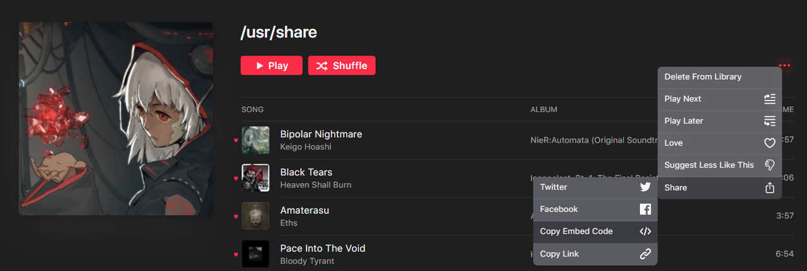
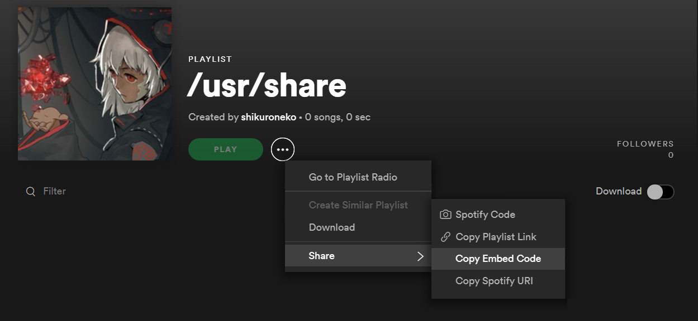
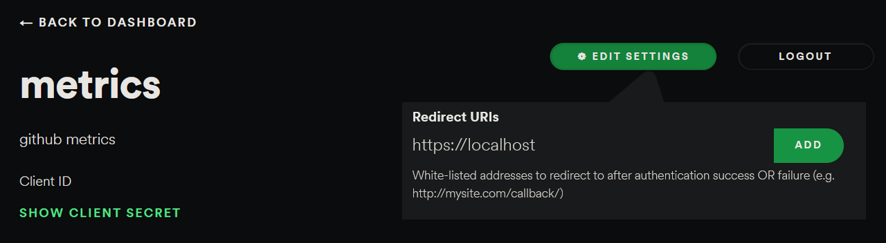
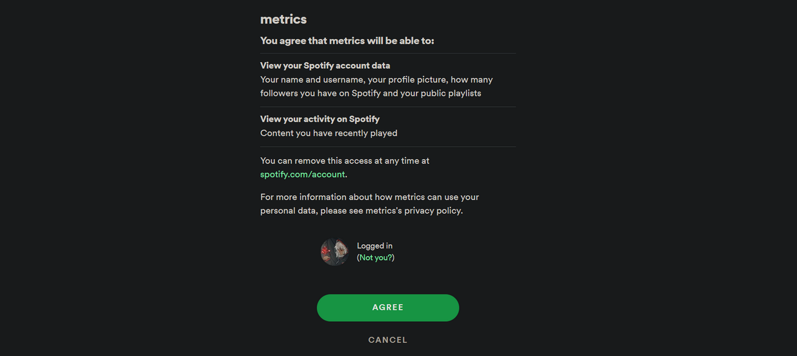
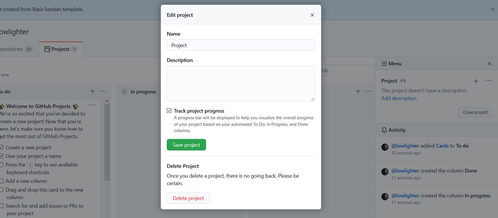
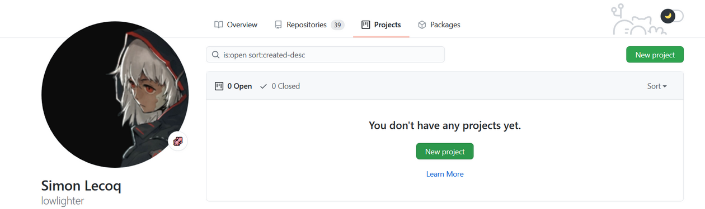
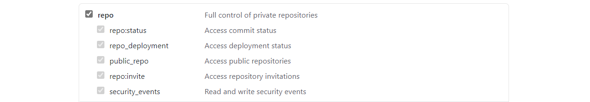
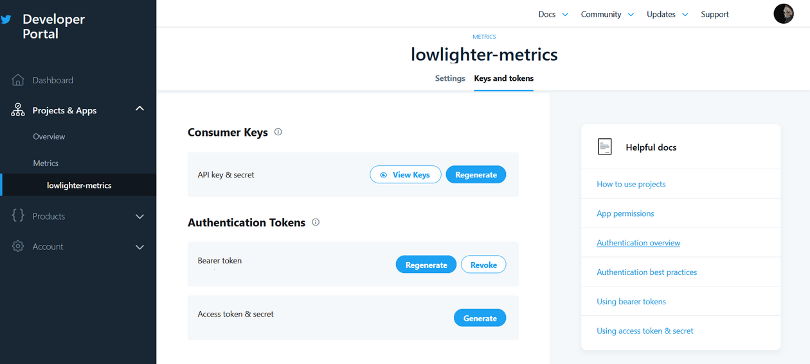

# 📊 GitHub metrics


Generates your own GitHub metrics image that you can embed on your profile page or elsewhere !

[](https://metrics.lecoq.io)

But there's more with [plugins](https://github.com/lowlighter/metrics/tree/master/src/plugins) and [templates](https://github.com/lowlighter/metrics/tree/master/src/templates) !

<table>
  <tr>
    <th><a href="https://github.com/lowlighter/metrics#%EF%B8%8F-pagespeed">⏱️ Google PageSpeed plugin</a></th>
    <th><a href="https://github.com/lowlighter/metrics#%EF%B8%8F-pagespeed">📅 Isometric calendar plugin</a></th>
  </tr>
  <tr>
    <td>
      <a href="https://github.com/lowlighter/metrics#%EF%B8%8F-pagespeed">
        
      </a>
      <details><summary>Alternate version</summary>
        <a href="https://github.com/lowlighter/metrics#%EF%B8%8F-pagespeed">
          
        </a>
      </detail>
    </td>
    <td>
      <a href="https://github.com/lowlighter/metrics#-isometric-calendar">
        
      </a>
      <details><summary>Alternate version</summary>
        <a href="https://github.com/lowlighter/metrics#-isometric-calendar">
          
        </a>
      </detail>
    </td>
  </tr>
  <tr>
    <th><a href="https://github.com/lowlighter/metrics#-music">🎼 Favorite music tracks plugin</a></th>
    <th><a href="https://github.com/lowlighter/metrics#-music">🎧 Recently listened music plugin</a></th>
  </tr>
  <tr>
    <td>
      <a href="https://github.com/lowlighter/metrics#-music">
        
      </a>
    </td>
    <td>
      <a href="https://github.com/lowlighter/metrics#-music">
        
      </a>
    </td>
  </tr>
  <tr>
    <th><a href="https://github.com/lowlighter/metrics#%EF%B8%8F-languages">🈷️ Most used languages plugin</a></th>
    <th><a href="https://github.com/lowlighter/metrics#%EF%B8%8F-follow-up">🎟️ Follow-up plugin</a></th>
  </tr>
  <tr>
    <td>
      <a href="https://github.com/lowlighter/metrics#%EF%B8%8F-languages">
        
      </a>
    </td>
    <td>
      <a href="https://github.com/lowlighter/metrics#%EF%B8%8F-follow-up">
        
      </a>
    </td>
  </tr>
  <tr>
    <th><a href="https://github.com/lowlighter/metrics#-lines">📌 Starred topics plugin</a></th>
    <th><a href="https://github.com/lowlighter/metrics#-traffic">🗂️ Active projects plugin</a></th>
  </tr>
  <tr>
    <td>
      <a href="https://github.com/lowlighter/metrics#-lines">
        
      </a>
    </td>
    <td>
      <a href="https://github.com/lowlighter/metrics#-traffic">
        
      </a>
    </td>
  </tr>
  <tr>
    <th><a href="https://github.com/lowlighter/metrics#-lines">👨‍💻 Lines of code plugin</a></th>
    <th><a href="https://github.com/lowlighter/metrics#-traffic">🧮 Repositories traffic plugin</a></th>
  </tr>
  <tr>
    <td>
      <a href="https://github.com/lowlighter/metrics#-lines">
        
      </a>
    </td>
    <td>
      <a href="https://github.com/lowlighter/metrics#-traffic">
        
      </a>
    </td>
  </tr>
  <tr>
    <th><a href="https://github.com/lowlighter/metrics#-tweets">🐤 Tweets plugin</a></th>
    <th><a href="https://github.com/lowlighter/metrics#%EF%B8%8F-posts">✒️ Recent posts plugin</a></th>
  </tr>
  <tr>
    <td>
      <a href="https://github.com/lowlighter/metrics#-tweets">
        
      </a>
    </td>
    <td>
      <a href="https://github.com/lowlighter/metrics#%EF%B8%8F-posts">
        
      </a>
    </td>
  </tr>
  <tr>
    <th><a href="https://github.com/lowlighter/metrics#-habits">💡 Coding Habits plugin</a></th>
    <th><a href="https://github.com/lowlighter/metrics#-gists">🎫 Gists plugin</a></th>
  </tr>
  <tr>
    <td>
      <a href="https://github.com/lowlighter/metrics#-habits">
        
      </a>
    </td>
    <td>
      <a href="https://github.com/lowlighter/metrics#-gists">
        
      </a>
    </td>
  </tr>
  <tr>
    <td colspan="2" align="center">
      <a href="https://github.com/lowlighter/metrics/issues/8">
        More to come soon !
      </a>
    </td>
  </tr>
</table>

<table>
  <tr>
    <th>Classic template</a></th>
    <th>Terminal template</a></th>
  </tr>
  <tr>
    <td>
      
    </td>
    <td>
      
    </td>
  </tr>
  <tr>
    <td colspan="2" align="center">
      More to come soon !
    </td>
  </tr>
</table>

## 🦑 Interested to get your own ?

Try it now at [metrics.lecoq.io](https://metrics.lecoq.io/) with your GitHub username !

Because some plugins require additional configuration and setup, some of them are not available at [metrics.lecoq.io](https://metrics.lecoq.io/).
For a fully-featured experience, consider using this as a [GitHub Action](https://github.com/marketplace/actions/github-metrics-as-svg-image) instead !

[](https://github.com/lowlighter/downtime)

# 📜 How to use ?

## ⚙️ Using GitHub Action on your profile repository (~5 min setup)

Setup a GitHub Action which runs periodically and pushes your generated metrics image on your repository.
See all supported options in [action.yml](action.yml).

Assuming your username is `my-github-user`, you can then embed your metrics in your repository readme like below :

```markdown

```

<details>
<summary>💬 How to setup ?</summary>

### 0. Prepare your personal repository

Create a repository with the same name as your GitHub username if it's not already done.


The `README.md` of it will be displayed on your user profile :


### 1. Create a GitHub token

From the `Developer settings` of your account settings, select `Personal access tokens` to create a new token.

No additional scopes are needed, unless you want to include your private repositories metrics or if you want to use the `traffic` plugin.


Be sure to enable `Include private contributions on my profile` in your account settings if you want to include your private contributions :


### 2. Set your GitHub token in your personal repository secrets

Go to the `Settings` of your personal repository to create a new secret and paste your freshly generated GitHub token there.


### 3. Create a new GitHub Action workflow on your personal repository

Create a new workflow from the `Actions` tab of your personal repository and paste the following :

```yaml
name: GitHub metrics
on:
  # Schedule updates
  schedule: [{cron: "0 * * * *"}]
  push: {branches: "master"}
jobs:
  github-metrics:
    runs-on: ubuntu-latest
    steps:
      # See action.yml for all options
      - uses: lowlighter/metrics@latest
        with:
          # Your GitHub token
          token: ${{ secrets.METRICS_TOKEN }}
          # GITHUB_TOKEN is a special auto-generated token restricted to current repository, which is used to push files in it
          committer_token: ${{ secrets.GITHUB_TOKEN }}
```

See all supported options in [action.yml](action.yml).

When using a token with additional permissions, it is advised to fork this repository to minimize security risks :
```yaml
      - uses: my-github-username/metrics@latest
```
In this case, consider watching new releases of this repository to stay up-to-date and enjoy latest features !

If you prefer examples rather than theory, check out this [workflow](https://github.com/lowlighter/lowlighter/blob/master/.github/workflows/metrics.yml) file which generates metrics daily.

#### Preview vs release

It is possible to use `@master` instead of `@latest` to use new features before their official release.
Breaking changes may occur occasionally on `@master`, which could result in your metrics not being generated temporarily.

#### What will happen ?

A new metrics image will be generated and committed to your repository on each run.


### 4. Embed the link into your README.md

Edit your repository readme and add your metrics image :

```markdown

```

</details>

## 💕 Using the shared instance (~1 min setup, but with limitations)

For conveniency, you can use the shared instance available at [metrics.lecoq.io](https://metrics.lecoq.io) without any additional setup.

Assuming your username is `my-github-user`, you can embed your metrics in your repository readme like below :

```markdown

```

Visit [metrics.lecoq.io](https://metrics.lecoq.io) for more informations.

<details>
<summary>💬 Restrictions and fair use</summary>

Since GitHub API has rate limitations, the shared instance has a few limitations :
  * Images are cached for 1 hour
    * Your generated metrics won't be updated during this amount of time when queried
  * A rate limiter is enabled, although it won't affect already cached users metrics
  * Plugins which consume additional requests, or require additional token scopes are disabled

If you're appreciating this project, consider using it as a GitHub Action instead.

</details>

## 🏗️ Deploying your own web instance (~15 min setup, depending on your sysadmin knowledge)

It is possible to setup your own instance if you don't want to use GitHub Actions or if you want to allow others users on your instance.

When sharing an instance, it is advised to restrict the number of users which can use it through the rate limiter or the access list, to avoid reaching the requests limit of GitHub APIs.

See all supported options in [settings.example.json](settings.example.json).

<details>
<summary>💬 How to setup ?</summary>

### 0. Prepare your server

You will need a server where you can setup and run a NodeJS application.

### 1. Create a GitHub token

From the `Developer settings` of your account settings, select `Personal access tokens` to create a new token.

No additional scopes are needed.


### 2. Install dependencies

Connect to server and ensure [NodeJS](https://nodejs.org/en/) is installed (see tested version in [workflow](.github/workflows/workflow.yml#L18)).

Run the following commands to clone this repository, install dependencies and copy configuration example file :

```shell
git clone https://github.com/lowlighter/metrics.git
cd metrics/
npm install --only=prod
cp settings.example.json settings.json
```

### 3. Configure your instance

Edit `settings.json` to configure your instance.

```javascript
{
  //See settings.example.json for all options
  //GitHub API token
    "token":"****************************************"
}
```

See all supported options in [settings.example.json](settings.example.json).

### 4. Start your instance

Run the following command to start your instance once you've finished configuring it :

```shell
npm start
```

From your browser, you should be able to access your web instance on the port you provided in `setting.json`.

### 5. Embed the link into your README.md

Edit your repository readme and add your metrics image from your server domain :

```markdown

```

### 6. (optional) Setup as service on your instance

To ensure that your instance will be restarted in case of reboots or crashs, you should setup it as a service.
This is described below for linux-like systems which supports *systemd*.

Create a new service file `/etc/systemd/system/github_metrics.service` and paste the following after editing paths inside :

```
[Unit]
Description=GitHub metrics
After=network-online.target
Wants=network-online.target

[Service]
Type=simple
WorkingDirectory=/path/to/metrics
ExecStart=/usr/bin/node /path/to/metrics/index.mjs

[Install]
WantedBy=multi-user.target
```

Reload services, enable it, start it and check if it is up and running :

```shell
systemctl daemon-reload
systemctl enable github_metrics
systemctl start github_metrics
systemctl status github_metrics
```

</details>

<details>
<summary>⚠️ HTTP errors code</summary>

The following errors code can be encountered on a web instance :

| Error code                | Description                                                                |
| ------------------------- | -------------------------------------------------------------------------- |
| `400 Bad request`         | Invalid query (e.g. unsupported template)                                  |
| `403 Forbidden`           | User not allowed in `restricted` users list                                |
| `404 Not found`           | GitHub API did not found the requested user                                |
| `429 Too many requests`   | Thrown when rate limiter is trigerred                                      |
| `500 Internal error`      | Server error while generating metrics images (check logs for more details) |
| `503 Service unavailable` | Maximum user capacity reached, only cached images can be accessed for now  |

</details>

<details>
<summary>🔗 HTTP parameters</summary>

Generated metrics images from a web instance can be configured through url parameters.

#### Configuring base content

Base content is enabled by default, but passing `?base=0` will disable all base content.
You can choose to selectively enable or disable a specific `<section>` with `?base.<section>=<1|0>`.

For example, to opt-out from `activity`, `community` and `metadata`, append `?base.activity=0&base.community=0&base.metadata=0` to your metrics url.

#### Configuring plugins

Plugins are disabled by default, but passing `?<plugin>=1` will enable a specific `<plugin>`.
Plugin options can be passed with `?<plugin>.<option>=<value>`.

For example, to enable `music` plugin and configure `music` plugin, you could append the following to your metrics url : `?music=1&music.provider=spotify&music.mode=recent&music.limit=4`.

Basically, most of [action.yml](action.yml) options can actually be used by web instance, with `plugin_` prefix dropped, and `.` instead of `_`.

</details>

# 📚 Documentation

## 🖼️ Templates

Templates allows you to change the general appearance of your metrics images.
Some metrics may be displayed differently, and all plugins may not be supported or behave the same from one template to another.

Consider trying them at [metrics.lecoq.io](https://metrics.lecoq.io) !

Used template defaults to the `classic` one.

<details>
<summary>💬 Template/plugin compatibily matrix</summary>

<table>
  <tr>
    <th>Template\Plugin</th>
    <th><span title="Base content">🗃️</span></th>
    <th><span title="PageSpeed">⏱️</span></th>
    <th><span title="Isometric calendar">📅</span></th>
    <th><span title="Music">🎼</span></th>
    <th><span title="Languages">🈷️</span></th>
    <th><span title="Follow-up">🎟️</span></th>
    <th><span title="Topics">📌</span></th>
    <th><span title="Projects">🗂️</span></th>
    <th><span title="Lines">👨‍💻</span></th>
    <th><span title="Traffic">🧮</span></th>
    <th><span title="Tweets">🐤</span></th>
    <th><span title="Posts">✒️</span></th>
    <th><span title="Habits">💡</span></th>
    <th><span title="Gists">🎫</span></th>
  </tr>
  <tr>
    <th>Classic</th>
    <td>✔️</td>
    <td>✔️</td>
    <td>✔️</td>
    <td>✔️</td>
    <td>✔️</td>
    <td>✔️</td>
    <td>✔️</td>
    <td>✔️</td>
    <td>✔️</td>
    <td>✔️</td>
    <td>✔️</td>
    <td>✔️</td>
    <td>✔️</td>
    <td>✔️</td>
  </tr>
  <tr>
    <th>Terminal</th>
    <td><span title="'Available for hire' is currently not displayed">✔️*</span></td>
    <td>✔️</td>
    <td>❌</td>
    <td>❌</td>
    <td>✔️</td>
    <td>✔️</td>
    <td>❌</td>
    <td>❌</td>
    <td>✔️</td>
    <td>✔️</td>
    <td>❌</td>
    <td>❌</td>
    <td>❌</td>
    <td>✔️</td>
  </tr>
</table>

*Hover a cell for more informations*.

</details>

## 🧩 Plugins

Plugins are features which can provide additional metrics and features.
In return, they may require additional configuration and consume additional API requests.

### 🗃️ Base content

Generated metrics contains a few sections that are enabled by default, such as recent activity, community stats and repositories stats.
This can be configured by explicitely opt-out from them.

<details>
<summary>💬 About</summary>

By default, generated metrics contains the following sections :
* `header`, which usually contains your username, your two-week commits calendars and a few additional data
* `activity`, which contains your recent activity (commits, pull requests, issues, etc.)
* `community`, which contains your community stats (following, sponsors, organizations, etc.)
* `repositories`, which contains your repositories stats (license, forks, stars, etc.)
* `metadata`, which contains informations about generated metrics

You can explicitely opt-out from them, which can be useful if you only want to keep a few sections or to use a plugin as standalone.

For example, to keep only `header` and `repositories` sections, add the following to your workflow :
```yaml
- uses: lowlighter/metrics@latest
  with:
    # ... other options
    base: "header, repositories" # opt-out from "activity", "community" and "metadata"
```

</details>

### ⏱️ PageSpeed

The *pagespeed* plugin adds the performances of the website attached mentioned on your account :


These are computed through [Google's PageSpeed API](https://developers.google.com/speed/docs/insights/v5/get-started), which yields the same results as [web.dev](https://web.dev).

<details>
<summary>💬 About</summary>

Although not mandatory, you can generate an API key for PageSpeed API [here](https://developers.google.com/speed/docs/insights/v5/get-started) to avoid 429 HTTP errors.

The website attached to the GitHub profile will be the one to be audited.
Expect 10 to 30 seconds to generate the results.

Add the following to your workflow :
```yaml
- uses: lowlighter/metrics@latest
  with:
    # ... other options
    plugin_pagespeed: yes
    plugin_pagespeed_token: ${{ secrets.PAGESPEED_TOKEN }}
```

You can display a detailed report along with scores :


See [performance scoring](https://web.dev/performance-scoring/) and [score calculator](https://googlechrome.github.io/lighthouse/scorecalc/) for more informations about how PageSpeed compute these statistics.

Add the following to your workflow instead :
```yaml
- uses: lowlighter/metrics@latest
  with:
    # ... other options
    plugin_pagespeed: yes
    plugin_pagespeed_detailed: yes
    plugin_pagespeed_token: ${{ secrets.PAGESPEED_TOKEN }}
```

</details>

### 📅 Isometric calendar

The *isocalendar* plugin displays an isometric view of your commits calendar, along with a few stats like current streak and commit average per day.


<details>
<summary>💬 About</summary>

It will consume two additional GitHub requests.

Add the following to your workflow :
```yaml
- uses: lowlighter/metrics@latest
  with:
    # ... other options
    plugin_isocalendar: yes
```

Use the following instead to display a full-year instead :
```yaml
- uses: lowlighter/metrics@latest
  with:
    # ... other options
    plugin_isocalendar: yes
    plugin_isocalendar_duration: full-year
```


</details>

### 🎼 Music

The *music* plugin can work in the following modes :

#### Playlist mode

Select randomly a few tracks from a given playlist so you can display your favorite tracks to your visitors.


<details>
<summary>💬 About</summary>

Select a music provider below for instructions.

<details>
<summary>Apple Music</summary>

Extract the *embed* url of the playlist you want to share.

To do so, connect to [music.apple.com](https://music.apple.com/) and select the playlist you want to share.
From `...` menu, select `Share` and `Copy embed code`.



Extract the source link from the code pasted in your clipboard :
```html
<iframe allow="" frameborder="" height="" style="" sandbox="" src="https://embed.music.apple.com/**/playlist/********"></iframe>
```

Finish the plugin setup by adding the following to your workflow :

```yaml
- uses: lowlighter/metrics@latest
  with:
    # ... other options
    plugin_music: yes
    plugin_music_provider: apple
    plugin_music_mode: playlist
    plugin_music_playlist: https://******** # Extracted source link
    plugin_music_limit: 4 # Set the number of tracks you want to display
```

</details>

<details>
<summary>Spotify</summary>

Extract the *embed* url of the playlist you want to share.

To do so, Open Spotify and select the playlist you want to share.
From `...` menu, select `Share` and `Copy embed code`.



Extract the source link from the code pasted in your clipboard :
```html
<iframe src="https://open.spotify.com/embed/playlist/********" width="" height="" frameborder="0" allowtransparency="" allow=""></iframe>
```

Finish the plugin setup by adding the following to your workflow :

```yaml
- uses: lowlighter/metrics@latest
  with:
    # ... other options
    plugin_music: yes
    plugin_music_provider: spotify
    plugin_music_mode: playlist
    plugin_music_playlist: https://******** # Extracted source link
    plugin_music_limit: 4
```

</details>

</details>

#### Recently played mode

Display tracks you played recently.


<details>
<summary>💬 About</summary>

Select a music provider below for additional instructions.

<details>
<summary>Apple Music</summary>

This mode is not supported for now.

I tried to find a way with *smart playlists*, *shortcuts* and other stuff but could not figure a workaround to do it without paying the 99$ fee for developper program.

So unfortunately this isn't available for now.

</details>

<details>
<summary>Spotify</summary>

Spotify does not have *personal tokens*, so it makes the process a bit longer because you're required to follow the [authorization workflow](https://developer.spotify.com/documentation/general/guides/authorization-guide/)... Follow the instructions below for a  *TL;DR* to obtain a `refresh_token`.

Sign-in to the [developer dashboard](https://developer.spotify.com/dashboard/) and create a new app.
Keep your `client_id` and `client_secret` and let this tab open for now.



Open the settings and add a new *Redirect url*. Normally it is used to setup callbacks for apps, but just put `https://localhost` insteadd (it is mandatory as per the [authorization guide](https://developer.spotify.com/documentation/general/guides/authorization-guide/), even if not used).

Forge the authorization url with your `client_id` and the encoded `redirect_uri` you whitelisted, and access it from your browser :

```
https://accounts.spotify.com/authorize?client_id=********&response_type=code&scope=user-read-recently-played&redirect_uri=https%3A%2F%2Flocalhost
```

When prompted, authorize your application.



Once redirected to `redirect_uri`, extract the generated authorization `code` from your url bar.


Go back to your developer dashboard tab, and open the web console of your browser to paste the following JavaScript code, with your own `client_id`, `client_secret`, authorization `code` and `redirect_uri`.

```js
(async () => {
  console.log(await (await fetch("https://accounts.spotify.com/api/token", {
    method:"POST",
    headers:{"Content-Type":"application/x-www-form-urlencoded"},
    body:new URLSearchParams({
      grant_type:"authorization_code",
      redirect_uri:"https://localhost",
      client_id:"********",
      client_secret:"********",
      code:"********",
    })
  })).json())
})()
```

It should return a JSON response with the following content :
```json
{
  "access_token":"********",
  "expires_in": 3600,
  "scope":"user-read-recently-played",
  "token_type":"Bearer",
  "refresh_token":"********"
}
```

With your `client_id`, `client_secret` and `refresh_token` you can finish the plugin setup by adding the following to your workflow :
```yaml
- uses: lowlighter/metrics@latest
  with:
    # ... other options
    plugin_music: yes
    plugin_music_provider: spotify
    plugin_music_token: "${{ secrets.SPOTIFY_CLIENT_ID }}, ${{ secrets.SPOTIFY_CLIENT_SECRET }}, ${{ secrets.SPOTIFY_REFRESH_TOKEN }}"
    plugin_music_mode: recent
    plugin_music_limit: 4
```

</details>

</details>

### 🈷️ Languages

The *languages* plugin displays which programming languages you use the most across all your repositories.


<details>
<summary>💬 About</summary>

Add the following to your workflow :
```yaml
- uses: lowlighter/metrics@latest
  with:
    # ... other options
    plugin_languages: yes
    plugin_languages_ignored: "" # List of comma separated languages to ignore
    plugin_languages_skipped: "" # List of comma separated repositories to skip
```

</details>

### 🎟️ Follow-up

The *follow-up* plugin displays the ratio of opened/closed issues and the ratio of opened/merged pull requests across all your repositories, which shows if they're well-maintened or not.


<details>
<summary>💬 About</summary>

Add the following to your workflow :
```yaml
- uses: lowlighter/metrics@latest
  with:
    # ... other options
    plugin_followup: yes
```

</details>

### 📌 Topics

The *topics* plugin displays your [starred topics](https://github.com/stars?filter=topics).
Check out [GitHub topics](https://github.com/topics) to search interesting topics.


<details>
<summary>💬 About</summary>

This uses puppeteer to navigate through your starred topics page.

You can choose to display and order topics by :
- Most `stars`
- Recent `activity`
- Recently `starred` by you
- `random`ly

Add the following to your workflow :
```yaml
- uses: lowlighter/metrics@latest
  with:
    # ... other options
    plugin_topics: yes
    plugin_topics_sort: stars
    plugin_topics_limit: 15
```

</details>

### 🗂️ Projects

The *projects* plugin displays the progress of your profile projects.


<details>
<summary>💬 About</summary>

It will consume an additional GitHub request.

Add the following to your workflow :
```yaml
- uses: lowlighter/metrics@latest
  with:
    # ... other options
    plugin_projects: yes
    plugin_projects_limit: 4
```

Note that by default, profile projects have progress tracking disabled.
To enable it, open the `≡ Menu` and edit the project to opt-in to `Track project progress` (it can be a bit confusing since it's actually not in the project settings).



<details>
<summary>💬 Create a personal project on GitHub</summary>

On your profile, select the `Projects` tab :


Fill the informations and set visibility to *public* :


</details>

</details>

### 👨‍💻 Lines

The *lines* of code plugin displays the number of lines of code you added and removed across all of your repositories.


<details>
<summary>💬 About</summary>

It will consume an additional GitHub request per repository.

Add the following to your workflow :
```yaml
- uses: lowlighter/metrics@latest
  with:
    # ... other options
    plugin_lines: yes
```

</details>

### 🧮 Traffic

    ⚠️ This plugin requires a personal token with full repo scope.

The repositories *traffic* plugin displays the number of pages views across your repositories.


<details>
<summary>💬 About</summary>

It will consume an additional GitHub request per repository.

Because of GitHub REST API limitation, provided token requires full `repo` scope to access traffic informations.



Add the following to your workflow :
```yaml
- uses: lowlighter/metrics@latest
  with:
    # Token with "repo" scope
    token: ${{ secrets.METRICS_TOKEN }}
    # ... other options
    plugin_traffic: yes
```

</details>

### 🐤 Tweets

    🚧 This plugin is available as pre-release on @master

The recent *tweets* plugin displays your latest tweets of the [twitter](https://twitter.com) attached mentioned on your account :


<details>
<summary>💬 About</summary>

Add the following to your workflow :
```yaml
- uses: lowlighter/metrics@latest
  with:
    # ... other options
    plugin_tweets: yes
    plugin_tweets_token: ${{ secrets.TWITTER_TOKEN }}
```

<details>
<summary>💬 Obtaining a twitter token</summary>

To get a twitter token, you'll need to apply to the [developer program](https://apps.twitter.com).
It's a bit tedious, but it seems that requests are approved quite quickly.

Create an app from your [developer dashboard](https://developer.twitter.com/en/portal/dashboard) and register your bearer token in your repository secrets.



</details>

</details>

### ✒️ Posts

The recent *posts* plugin displays recent articles you wrote on an external source, like [dev.to](https://dev.to).


<details>
<summary>💬 About</summary>

Supported sources are :
* [dev.to](https://dev.to)

Add the following to your workflow :
```yaml
- uses: lowlighter/metrics@latest
  with:
    # ... other options
    plugin_posts: yes
    plugin_posts_source: ********
```

</details>

### 💡 Habits

The coding *habits* add deduced coding habits based on your recent activity, from up to 100 events.


<details>
<summary>💬 About</summary>

It will consume an additional GitHub request per event fetched.

Because of GitHub REST API limitation, provided token requires full `repo` scope to access **private** events.
Events that cannot be fetched will be ignored so it is still possible to use this plugin with a scope-less token.

Add the following to your workflow :
```yaml
- uses: lowlighter/metrics@latest
  with:
    # ... other options
    plugin_habits: yes
    plugin_habits_from: 100
```

</details>

### 🎫 Gists

The *gists* plugin displays your [gists](https://gist.github.com) metrics.


<details>
<summary>💬 About</summary>

It will consume an additional GitHub request per gist fetched.

Add the following to your workflow :
```yaml
- uses: lowlighter/metrics@latest
  with:
    # ... other options
    plugin_gists: yes
```

</details>

## 💪 Contributing and customizing

To suggest a new feature, find a bug or need help, fill an [issue](https://github.com/lowlighter/metrics/issues) describing your problem or your needs.

If you're motivated enough, you can submit a [pull request](https://github.com/lowlighter/metrics/pulls) to integrate new features or to solve open issues.

Read [CONTRIBUTING.md](CONTRIBUTING.md) for more information about this.

## 📖 Useful references

* [GitHub GraphQL API](https://docs.github.com/en/graphql)
* [GitHub GraphQL Explorer](https://docs.github.com/en/free-pro-team@latest/graphql/overview/explorer)
* [GitHub Rest API](https://docs.github.com/en/rest)
* [GitHub Octicons](https://github.com/primer/octicons)
  * See [GitHub Logos and Usage](https://github.com/logos) for more information.

### ✨ Inspirations

* [anuraghazra/github-readme-stats](https://github.com/anuraghazra/github-readme-stats)
* [jstrieb/github-stats](https://github.com/jstrieb/github-stats)
* [ankurparihar/readme-pagespeed-insights](https://github.com/ankurparihar/readme-pagespeed-insights)
* [jasonlong/isometric-contributions](https://github.com/jasonlong/isometric-contributions)
